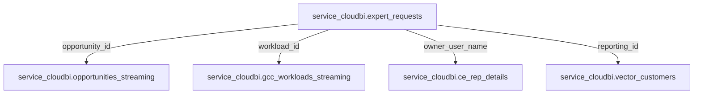

# Expert Requests (ER) Schema & Metric Taxonomy Reference

This reference details the database schema, status lifecycles, field mappings, and join rules for querying Customer Engineering (CE) Expert Requests.

---

## 1. Primary Table & Column Definitions

- **Primary Table:** `concord-prod.service_cloudbi.expert_requests`

| Column Name                    | Data Type        | Description                                                                      |
| :----------------------------- | :--------------- | :------------------------------------------------------------------------------- |
| `expert_request_id`            | STRING           | Unique system identifier for the Expert Request.                                 |
| `name`                         | STRING           | Title or display name of the request.                                            |
| `owner_user_name`              | STRING           | LDAP of the assigned expert / CE owner.                                          |
| `status`                       | STRING           | Current status (`'New'`, `'Accepted'`, `'Assigned'`, `'Completed'`, `'Closed'`). |
| `created_date`                 | DATE / TIMESTAMP | Date the Expert Request was formally submitted.                                  |
| `reporting_id`                 | STRING           | Unique customer account identifier.                                              |
| `opportunity_id`               | STRING           | Linked SFDC Opportunity ID (if deal-attached).                                   |
| `workload_id`                  | STRING           | Linked GCC Workload ID (if workload-attached).                                   |
| `customer.account_name`        | STRING           | Display name of the customer account.                                            |
| `expert_request_field_history` | RECORD (ARRAY)   | Audit log of status transitions and completion timestamps.                       |

---

## 2. Status Lifecycle & Filtering Categories

Expert Requests transition through distinct workflow stages:

| Category                | Status Values                       | Reporting Use Case                                           |
| :---------------------- | :---------------------------------- | :----------------------------------------------------------- |
| **In-Flight (Active)**  | `'New'`, `'Accepted'`, `'Assigned'` | Active engagements currently being worked on by specialists. |
| **Completed**           | `'Completed'`                       | Successfully delivered technical engagements.                |
| **Terminal / Inactive** | `'Closed'`, `'Cancelled'`           | Cancelled or declined requests.                              |

### Standard Filter Snippets:

```sql
-- Filter for Active (In-Flight) ERs
WHERE expert_requests.status IN ('New', 'Accepted', 'Assigned')

-- Filter for Completed ERs in the Current Calendar Year
WHERE expert_requests.status = 'Completed'
  AND expert_requests.created_date >= DATE_TRUNC(CURRENT_DATE('UTC'), YEAR)
```

---

## 3. Metric Taxonomy & Aggregations

| Metric Name                  | Calculation Formula                                                                            |
| :--------------------------- | :--------------------------------------------------------------------------------------------- |
| **Completed ERs Count**      | `COUNT(DISTINCT CASE WHEN status = 'Completed' THEN expert_request_id END)`                    |
| **In-Flight ERs Count**      | `COUNT(DISTINCT CASE WHEN status IN ('New','Accepted','Assigned') THEN expert_request_id END)` |
| **Attached ACV (Completed)** | `SUM(DISTINCT opportunities.usd_acv)` for completed ERs (with MD5 deduplication).              |
| **Attached ARR (Completed)** | `SUM(workloads_view.metrics.annual_gross_revenue)` for workloads with completed ERs.           |
| **Engaged Accounts Count**   | `COUNT(DISTINCT reporting_id)` for accounts with active or completed ERs.                      |

---

## 4. Table Relationships & Join Paths

Use these standard joins to enrich Expert Request records with pipeline deals, workloads, or rep alignments:



### Join SQL Snippet:

```sql
FROM `concord-prod.service_cloudbi.expert_requests` AS er
LEFT JOIN `concord-prod.service_cloudbi.opportunities_streaming` AS o
       ON er.opportunity_id = o.opportunity_id
LEFT JOIN `concord-prod.service_cloudbi.gcc_workloads_streaming` AS w
       ON er.workload_id = w.workload_id
LEFT JOIN `concord-prod.service_cloudbi.ce_rep_details` AS rep
       ON er.owner_user_name = rep.rep_ldap
LEFT JOIN `concord-prod.service_cloudbi.vector_customers` AS vc
       ON er.reporting_id = vc.reporting_id
```
