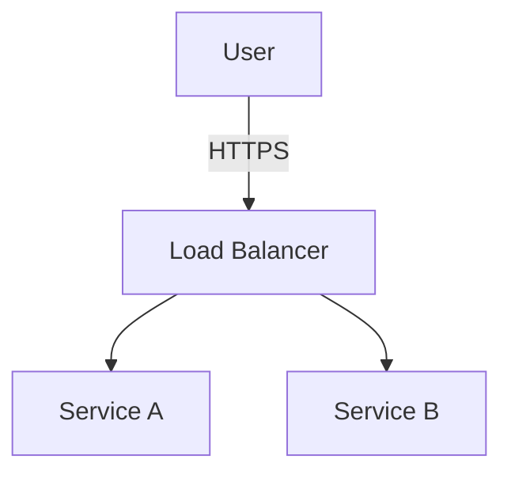

# Creating GCP Diagrams

This skill guides you to create architectural diagrams for Google Cloud codelabs. It involves generating Mermaid code first and then using that to create a high-quality image with Google Cloud styling.

## Workflow

### 📋 Step 1: Generate Mermaid Code

Based on the codelab content, design a Mermaid diagram that illustrates the architecture or flow.

-   Use standard Mermaid syntax (e.g., `graph TD`, `sequenceDiagram`).
-   Keep it simple and focused on the key concepts (e.g., VPC, Load Balancer, Backends).
-   Use descriptive labels for nodes.

**Diagram Types:**
-   **Topology/Architecture**: Use `graph TD` or `graph LR`. Use for showing static infrastructure setup (VPCs, Subnets, LBs, VMs) and relationships.
-   **Flow/Sequence**: Use `sequenceDiagram`. Use for showing dynamic interactions, packet flows, or step-by-step processes over time.

Example:

### 🎨 Step 2: Generate Styled Image

Use the `generate_image` tool to create the final image asset. You must translate the Mermaid structure into a descriptive prompt for the image generation model, applying Google Cloud styling.

**Google Cloud Architecture Diagram Style Guide (Summary):**
-   **Accessibility (WCAG)**: Maintain high contrast (4.5:1 min). Text labels on all icons. Do not rely on color alone.
-   **Card System**:
    -   Border: 2pt weight, 6pt radius. Color: Google Gray 900 (`#202124`).
    -   Icon sizing: 35px for products, 25px for services/users.
-   **Typography**: Centered and flush-left.
    -   Primary: 14pt Google Sans Text Bold, Gray 900.
    -   Subtext: 12pt Google Sans Text Normal, Gray 900.
    -   Code: 12pt Roboto Mono Normal, Gray 900.
-   **Boundaries & Containers**: Use luminosity for contrast.
    -   Project: Blue 600 (`#1A73E8`) background.
    -   Region: Gray 100 (`#F1F3F4`) background.
    -   Zone: Blue 200 (`#AECBFA`) or Gray 300 (`#DADCE0`).
-   **Paths & Connections**:
    -   Solid line, Gray 900 for primary flow.
    -   Dashed line, Gray 900 for secondary flow.
-   **Exporting**: SVG is preferred. PNG at 72 DPI as fallback.

**Prompt Template:**
"A professional technical architecture diagram for a Google Cloud setup following the official style guide. Use Gray 900 borders with 6pt radius for cards. Typography must use Google Sans or Roboto Mono for code. Use Blue 600 for Project, Gray 100 for Region backgrounds. Paths should be solid or dashed Gray 900. Content: {description_of_architecture_based_on_mermaid}. Use a light background."

**Execution:**
1. Call `generate_image` with the constructed prompt and a descriptive image name.
2. **Mandatory**: Copy the generated image from the artifacts directory to the source lab's folder (e.g., `.agents/skills/codelab-creation/examples/<lab-name>/`). If an `img/` subdirectory is preferred, create it there.

## Constraints
-   **No Truncation**: Ensure the full Mermaid code is valid.
-   **Descriptive Names**: Use descriptive snake_case names for generated images (e.g., `sni_proxy_architecture`).
