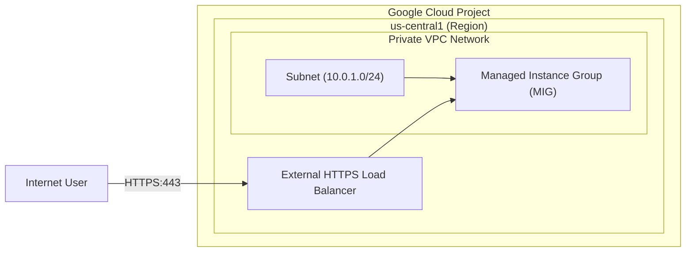
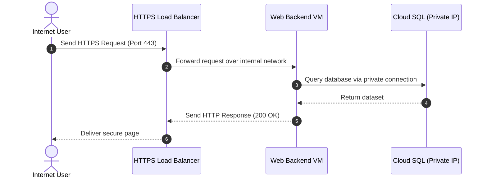

# Creating Google Cloud Architecture Diagrams & Assets

This skill guides you to create professional, high-fidelity architectural diagrams, network topologies, flow sequences, and mockups. The workflow comprises designing structural Mermaid diagrams and converting them into production-grade styled images using the **`generate_image`** tool.

---

## Core Workflow

### 📋 Step 1: Generate & Validate Mermaid Code
Before creating a visual asset, design a robust Mermaid diagram to map out the topology, trust boundaries, and interactions.

#### A. Topology/Architecture Diagrams (VPCs, Subnets, VMs, Services)
Use `graph LR` (Left-to-Right) or `graph TD` (Top-to-Down). Define boundaries (Projects, Regions, VPCs) using Mermaid `subgraph` blocks.


#### B. Traffic/Interaction Sequence Diagrams
Use `sequenceDiagram` to map out packet flows, handshake procedures, or dynamic API orchestration.


---

### 🎨 Step 2: Formulate the Image Prompt (Imagen 3 Blueprint)
Translate the Mermaid structure into a highly specific, detailed prompt for the **`generate_image`** tool. The prompt must enforce a premium, unified Google Cloud design style.

#### Google Cloud Design System Requirements:
1. **Background**: Must be clean, light, or solid white (`#FFFFFF`). Never use dark, colorful, or busy backgrounds.
2. **Layout & Structure**: Use sharp 2D flat-vector designs. Use containers (projects, VPC boundaries) with clear border outlines:
   - **Project / Region Boundary**: Google Cloud Blue (`#1A73E8`) borders.
   - **Component Card**: Border weight 2pt, rounded corner radius 6pt, border color Gray 900 (`#202124`).
3. **Colors**: Restrict the palette to Google-harmonious tones:
   - **Primary Accents**: Blue 600 (`#1A73E8`), Blue 200 (`#AECBFA`).
   - **Base Elements**: Clean White backgrounds, solid Gray 900 (`#202124`) lines.
4. **Typography**: Clear, centered, legible font rendering:
   - **Headers/Labels**: Google Sans Bold, Gray 900.
   - **Code/IP Ranges**: Roboto Mono, Gray 900.
5. **Exclusions**: Avoid 3D realistic models, diagonal/slanted layouts, drop shadows, gradient fills, and floating unlabeled shapes.

#### Prompt Formulation Template:
> "A professional flat-vector 2D Google Cloud architecture diagram. The layout is structured left-to-right on a solid white background. It depicts a Google Cloud Project boundary with a thin Blue (#1A73E8) outline, enclosing a region containing a VPC network. The diagram features clean rectangular cards with Gray 900 (#202124) borders and 6px rounded corners. Connectors are crisp solid black horizontal arrows showing logical flow. 
> 
> Cards are labeled as follows:
> - A card on the far-left representing the 'Internet User'.
> - An arrow connects it to 'HTTPS Load Balancer' (labeled 'GCLB').
> - Arrows connect 'GCLB' to two backends labeled 'Web Backend Service' inside a 'Private Subnet'.
> 
> Typography uses a clean sans-serif font (Google Sans style) for labels. The overall aesthetic is premium, corporate, clean, minimalist, and aligned with official GCP style guides. No 3D shapes, no busy background patterns."

---

### 🛠️ Step 3: Execute `generate_image`
Call the `generate_image` tool with the formulated prompt. Keep the image name descriptive, short (max 3 words), and written in `snake_case`.

#### Execution Example:
```json
{
  "ImageName": "gclb_mig_topology",
  "Prompt": "A professional 2D flat-vector Google Cloud network topology diagram on a solid white background. Shows a Google Cloud Project boundary with a thin blue (#1A73E8) outline containing a regional VPC. Crisp rectangular cards with Gray 900 (#202124) borders and rounded corners. A card labeled 'User' on the left connects with a solid black arrow to an 'HTTPS Load Balancer (GCLB)'. The GCLB connects via internal network path arrows to a 'Managed Instance Group (MIG)' card. Clean sans-serif text labels. Light, clean, minimalist aesthetic."
}
```

---

### 📂 Step 4: Organize & Move the Asset
Once `generate_image` successfully writes the file to the `/usr/local/google/home/shacharb/.gemini/jetski/artifacts/` directory:

1. **Locate the Artifact**: Find the path of the generated image from the tool execution output (e.g., `/usr/local/google/home/shacharb/.gemini/jetski/artifacts/gclb_mig_topology.png`).
2. **Copy the Asset**: Proactively copy the generated image from the artifacts directory to the target directory using shell commands (e.g., into the specific project's asset folder `meeting/customer_a/assets/` or your codelab's `img/` folder).
3. **Reference in Markdown**: Embed the image using its local absolute path:
   ``

---

## Gotchas & Troubleshooting

* **Card/Label Mismatches**: If the generated image contains garbled, illegible, or misspelled text, simplify the prompt's component list. Refine card names to use very short, standard abbreviations (e.g., use `VM Instance`, `GCLB`, `VPC`, `DB` instead of long descriptions).
* **Mermaid Special Characters**: In Mermaid node definitions, always wrap labels containing special characters (parentheses, brackets, IP addresses, port numbers) in double quotes. For example, use `id["Subnet (10.0.1.0/24)"]` instead of `id[Subnet (10.0.1.0/24)]`.
* **No Relative Paths**: Never use relative paths (`./assets/image.png`) to link images in workspace markdown documents. Always use absolute local URIs (`file:///usr/local/google/home/...`) to ensure the Markdown engine renders the diagram perfectly in preview tabs.
