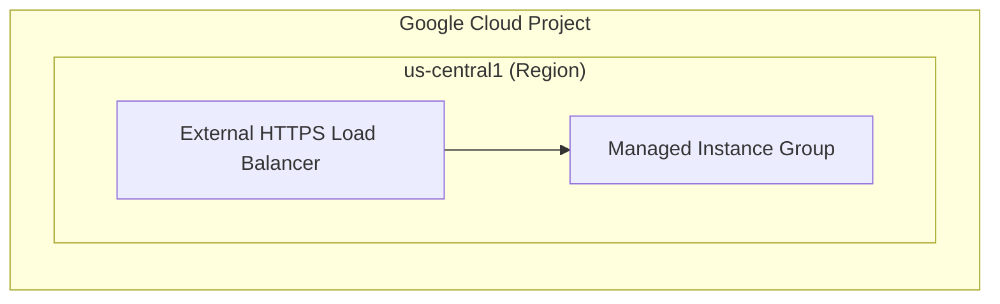

# Skill: Creating Google Cloud Architecture Diagrams & Assets (10x Multimodal)

This skill guides you to create professional, high-fidelity architectural diagrams, network topologies, flow sequences, and mockups. By leveraging multimodal reasoning capabilities directly within our **`generate_image`** tool context, you can ingest complex technical documentation, infrastructure code, or design specifications directly, ensuring accurate visual rendering and native real-world grounding in official Google Cloud visual standards.

---

## The 10x Workflow vs Legacy Approach

*   **Legacy Approach**: Translate architecture descriptions into intermediate Mermaid code, summarize it, and pass a generic text prompt to an image generator, which often lost structural nuances and resulted in garbled text.
*   **10x Multimodal Approach**: Direct technical source ingestion! Ingest the Codelab Markdown, Terraform `.tf` code, or Design blueprints directly. Formulate a highly descriptive prompt directly from the source material, and let the image generation model render structured cards, logical flow connections, and clean typography natively.

---

## Core Workflow Steps

Copy this checklist and track progress:
- [ ] Step 1: Ingest source material (Codelab markdown, Terraform `.tf`, or Design doc)
- [ ] Step 2: Extract architectural topology and construct a detailed prompt
- [ ] Step 3: Run `generate_image` with the formulated prompt
- [ ] Step 4: Verify output image and copy to target destination folder
- [ ] Step 5: Embed and reference the diagram in your markdown document

---

## Operational Workflow

### 📋 Step 1: Ingest Source Material & Extract Topology
Read the relevant source material in the workspace. Identify key architectural components (VPCs, Subnets, Load Balancers, GKE clusters, Cloud Run, Spanner databases, Cloud Storage buckets) and their connections.

*Optional (For Complex Topologies)*: If the routing or relationships are highly intricate, first construct and validate a local Mermaid flowchart to confirm the layout before formulating the prompt:


### 🎨 Step 2: Formulate Prompt & Run Generation
Translate the extracted technical architecture and relationships into a highly specific, structured prompt. Enforce official Google Cloud visual styles.

#### Google Cloud Design Guide Specifications:
1.  **Background**: Must be clean, solid white (`#FFFFFF`) or very light gray. Never use dark, black, or busy background patterns.
2.  **Containers**: Use 2D flat-vector style cards with clear borders:
    *   **Project / Region Boundaries**: Google Cloud Blue (`#1A73E8`) outlines.
    *   **Component Cards**: Border weight 2pt, rounded corner radius 6px, border color Gray 900 (`#202124`).
3.  **Typography**: LEGIBLE, sharp, centered text labels:
    *   **Labels**: Google Sans Bold, Gray 900.
    *   **IP Ranges / Port Codes**: Roboto Mono, Gray 900.
4.  **Paths**: Crisp solid black horizontal arrows (`#202124`) for primary flow; dashed black arrows for secondary/control paths.

#### Prompt Template:
> "A professional flat-vector 2D Google Cloud architecture diagram. The layout is structured left-to-right on a solid white background. It depicts a Google Cloud Project boundary with a thin Blue (#1A73E8) outline, enclosing a region containing a VPC network. The diagram features clean rectangular cards with Gray 900 (#202124) borders and 6px rounded corners. Connectors are crisp solid black horizontal arrows showing logical flow.
> 
> Cards are labeled as follows:
> - A card on the far-left representing the 'Internet User'.
> - An arrow connects it to 'HTTPS Load Balancer' (labeled 'GCLB').
> - Arrows connect 'GCLB' to two backends labeled 'Web Backend Service' inside a 'Private Subnet'.
> 
> Typography uses a clean sans-serif font (Google Sans style) for labels. Content: {insert_your_extracted_architecture_details}"

#### Execution:
Call the native `generate_image` tool using your constructed prompt. Keep the `ImageName` descriptive, short, and in `snake_case` (e.g., `gke_tpu_ingress`).

```json
{
  "ImageName": "gke_tpu_ingress",
  "Prompt": "A professional 2D flat-vector Google Cloud network topology diagram on a solid white background. Shows a Google Cloud Project boundary with a thin blue (#1A73E8) outline containing a GKE cluster. Crisp rectangular cards with Gray 900 (#202124) borders and rounded corners. A card labeled 'User' on the left connects with a solid black arrow to an 'HTTPS Load Balancer (GCLB)'. The GCLB connects via internal network path arrows to 'GKE Pods' inside a subnet. Typography uses a clean sans-serif font."
}
```

### 📁 Step 3: Verify & Placement
1.  Verify the generated image is written correctly to `{app_data_dir}/artifacts/`.
2.  **Mandatory**: Copy the generated PNG/SVG from the artifacts folder into the target project/codelab subdirectory (e.g., `meeting/customer_a/assets/` or codelab `img/` folder).
3.  Link the diagram in your Markdown file using its absolute local URI:
    ``

---

## Gotchas & Troubleshooting

*   **Card/Label Mismatches**: If the generated diagram contains misspelled or garbled text inside cards, simplify the component names in the prompt. Refine card labels to use standard short abbreviations (e.g., use `VM`, `GCLB`, `VPC`, `DB` instead of long descriptions).
*   **No Relative Paths**: Never use relative paths (`./assets/image.png`) to link images in workspace Markdown files. Always use absolute local URIs (`file:///usr/local/google/home/...`) to ensure the Markdown engine renders previews perfectly.
*   **Mermaid Special Characters**: In Mermaid definitions, always wrap labels containing special characters (parentheses, brackets, IP addresses, port numbers) in double quotes. E.g. `id["Subnet (10.0.1.0/24)"]`.
