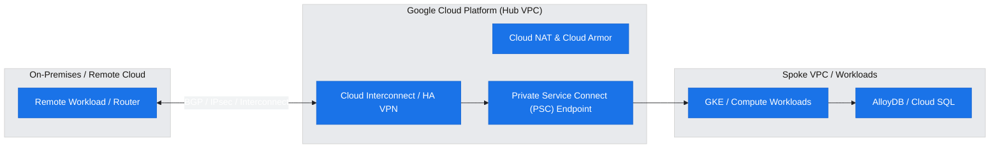
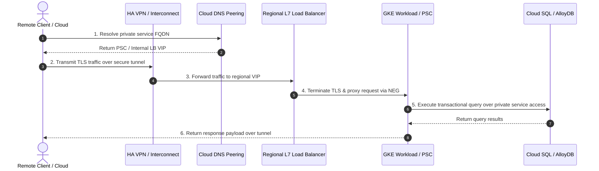

# [Customer / Project Name]: [Architecture Solution Title]

**Author:** Practice CE / Cloud Architect  
**Date:** [YYYY-MM-DD]  
**Status:** [Draft | Reviewed | Final]  
**Target Audience:** Cloud Architect / Enterprise Operator

---

## 1. Executive Summary & Problem Framing

[Provide a high-level executive summary of the customer's business drivers, technical objectives, and current pain points. Summarize the proposed architecture and expected business outcomes.]

### WAF Discovery & Customer Priorities (`agent_waf_system` Outcomes)

Before selecting the hybrid interconnect topology, the following priorities were established via WAF discovery using the native `agent_waf_system` skill:

- **Bandwidth & Throughput**: [e.g., Moderate (< 3 Gbps) | High Throughput (10-100 Gbps)]
- **Latency Sensitivity & SLA**: [e.g., Mission-Critical 99.99% sub-10ms | Standard 99.99% over internet]
- **Security Perimeter & Isolation**: [e.g., Private Service Connect (PSC) zero-peering | VPC-SC Bridge]
- **Cost vs. Redundancy**: [e.g., Maximize Redundancy (Active-Active) | Optimize Cost]

> [!IMPORTANT]
> **Pre-GA / Preview Feature Alert**  
> [If any proposed product, feature, or API is in Preview, Alpha, Beta, or otherwise Pre-GA, explicitly list them here with their current launch stage and required whitelisting/flags. If all components are General Availability (GA), state: "All components proposed in this architecture are Generally Available (GA)."]

---

## 2. Technical Architecture & Topology

[Detailed technical description of the proposed solution architecture (e.g., Cross-Cloud Networking, Hybrid Connectivity, VPC Peering, Private Service Connect, Cloud DNS routing, Security Perimeters).]

### High-Fidelity Architecture Diagram

_Note: Rendered via `creating_gcp_diagrams` and stored in `assets/architecture_diagram.png`._

#### Architectural Topology Draft (Mermaid)

---

## 3. Communication Sequence & Traffic Flows

[Explain the step-by-step request flow, DNS resolution sequence, failover behaviors, and authentication/encryption handshakes.]

### Communication Sequence Chart

> [!NOTE]
> **Asset Storage Location**: The sequence chart visual asset is saved in `assets/sequence_chart.png`.

---

## 4. Well-Architected Framework (WAF) Alignment & Verification

This architecture is designed and verified against the Google Cloud Well-Architected Framework pillars using `agent_waf_system`, directly mapping to the priorities gathered during discovery:

| WAF Pillar                         | Architectural Design Decision & Mitigation                                                             | Verification Evidence / Reference |
| :--------------------------------- | :----------------------------------------------------------------------------------------------------- | :-------------------------------- |
| **Operational Excellence**         | [e.g., Infrastructure as Code via Terraform, Cloud Trace & Audit Logging integration]                  | [Citation / DOC link]             |
| **Security, Privacy & Compliance** | [e.g., Least privilege IAM, VPC Service Controls perimeters, private endpoints only]                   | [Citation / DOC link]             |
| **Reliability**                    | [e.g., Multi-region HA VPN failover, regional managed instance groups, automated backup]               | [Citation / DOC link]             |
| **Cost Optimization**              | [e.g., Right-sized compute resources, Cloud NAT port allocation optimization, committed use discounts] | [Citation / DOC link]             |
| **Performance Efficiency**         | [e.g., Dedicated Interconnect for low latency, PSC for high-throughput service connectivity]           | [Citation / DOC link]             |

---

## 5. Citations & Validated Documentation Links

Every claim, configuration flag, and architectural pattern in this report is grounded in official Google Cloud documentation and verified internal engineering knowledge:

1. **[Private Service Connect (PSC) Overview](https://cloud.google.com/vpc/docs/private-service-connect)** - Grounding for private consumer-producer networking without peering.
2. **[HA VPN Topology & Routing](https://cloud.google.com/network-connectivity/docs/vpn/concepts/topologies)** - Validated architecture for SLA 99.99% cross-cloud connectivity.
3. **[Cloud DNS Peering & Forwarding](https://cloud.google.com/dns/docs/zones/forwarding-zones)** - Guidance for hybrid DNS resolution across cloud boundaries.
4. **[Google Cloud Well-Architected Framework](https://cloud.google.com/architecture/framework)** - Core architectural standards and pillar verification.
5. **[Google Cloud Interconnect Overview](https://cloud.google.com/network-connectivity/docs/interconnect/concepts/overview)** - Guidance for dedicated and partner hybrid circuits.

---

_Generated by Antigravity CE Solution Researcher_
