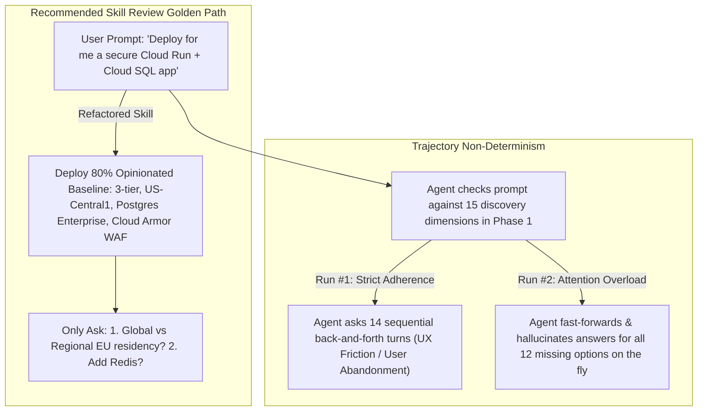

# LLM Attention Mechanics & Agent Skill Failure Modes

This reference details the underlying machine learning attention dynamics, token budget degradation patterns, and prompt engineering root causes that govern why AI agent skills fail at runtime or induce trajectory non-determinism (`evalin` variance). Reviewers must use these exact mechanics when diagnosing skill CLs and explaining required remediations.

---

## 1. Attention Budget Degradation & "Lost in the Middle"

Even though frontier Large Language Models (e.g., Gemini 3.1 Pro and beyond)
support multi-million token context windows, their **effective attention
budget**—the structural capacity of the attention mechanism to strictly weight
and adhere to specific behavioral constraints—degrades as prompt density
increases.

### 1.1 Inverted Attention Weights (`The Middle Token Drop`)
When an agent loads a skill, the context window is shared across the system prompt, conversation history, loaded tool schemas, the `SKILL.md` body, reference documents, and the user's active prompt.

* **The Mechanism**: Multi-head self-attention mechanisms exhibit a U-shaped attention distribution curve across long prompts (`Lost in the Middle` phenomenon). Tokens placed near the beginning (system prompt/YAML metadata) and very end (user query/immediate tool output) command the highest attention weights. Tokens buried inside the middle of large reference files or dense checklists experience significant attention dilution.
* **Pre-trained Weight Fallback (Hallucination)**: When a critical constraint (e.g., *"open egress port 443 for Cloud SQL sidecar cert exchange"* or *"use `--format=proto` for outputs over 64KB"*) resides deep inside a multi-page reference checklist, the diluted attention weight fails to override the model's pre-trained network weights. The model reverts to its dominant training data priors—inventing public IPs, writing legacy syntax (e.g., Cloud Run `v1`), or omitting required IAM bindings.

### 1.2 The MUST/ALWAYS Caps-Lock Smell (`Over-Conditioning`)
Authors frequently attempt to counteract attention dilution by shouting in caps-lock (`you MUST verify`, `MANDATORY 9 SPECIFICATIONS`, `CRITICAL CHECKLIST`, `ALWAYS check`).

* **Why Caps-Lock Shouting Fails**: Caps-lock directives do not increase attention capacity or provide structural context. Instead, when an LLM encounters multiple overlapping caps-lock commands across `SKILL.md` and reference checklists, the prompt becomes **severely over-conditioned**. The model treats competing caps-lock rules as noisy, high-entropy tokens, leading to random rule prioritization or complete instruction skipping.
* **The Engineering Fix (`Explain the Why`)**: Models generalize from understood intent significantly better than from rigid caps-lock laws. Pairing a concise directive with clear engineering rationale (`"Check credentials before making RPC calls — expired certs are the #1 cause of silent failures in this system, and the error doesn't mention certs"`) anchors the constraint in causal logic that persists across middle-token decoding.

---

## 2. Combinatorial Explosion & Menu of Alternatives (`Non-Determinism`)

Central Skills strictly enforce the rule: **One Default, One Escape Hatch** (`writing-guide.md`). When a skill presents a branching menu of alternatives across multiple layers, it guarantees high variance and non-deterministic trajectories across `evalin` ablation trials.

### 2.1 The $2^N$ Branching Decision Space
Consider a cloud architecture or workflow skill that presents competing options across just 4 independent dimensions without locked-down defaults:

1. Load Balancer Topology (`Global vs. Regional`)
2. VPC Egress (`ALL_TRAFFIC vs. PRIVATE_RANGES_ONLY`)
3. Database Edition (`Enterprise vs. Enterprise Plus`)
4. Proxy Connection Path (`Unix Domain Socket vs. TCP Forwarding Endpoint`)

$$\text{Total Decision Combinations} = 2 \times 2 \times 2 \times 2 = 16 \text{ distinct branching trajectories}$$

* **The Mechanism**: Without an opinionated default hardcoded into the baseline workflow, the LLM evaluates the probability distribution of each branch at runtime. Even at low sampling temperatures ($T=0.2$), minor nuances in user prompt phrasing, prior conversation turn noise, or floating-point attention shifts cause the agent to take different branches across identical `evalin` runs.
* **The Engineering Fix**: Eliminate the menu of alternatives completely. Lock down an **opinionated 80% golden path** (`US-Central1, 3-tier, Postgres Enterprise on Cloud SQL, Cloud Armor WAF, Direct VPC Egress ALL_TRAFFIC, and Unix domain socket sidecar connections`). Handle alternative branches strictly as conditional *One Escape Hatch* exceptions at the bottom of the skill (`"Only use a Regional Application Load Balancer if the user prompt explicitly demands EU GDPR data residency"`).

---

## 3. The Questionnaire Interrogation Trap (`Phase 1 Fatigue`)

A common anti-pattern in workflow design is instructing the agent to conduct a comprehensive requirements discovery phase (`Phase 1`) by presenting an exhaustive list of 10–15 discovery topics (`ask remaining questions concisely one at a time`).

### 3.1 Ergonomic Friction vs. Fast-Forward Hallucination

* **UX Interrogation**: If the agent strictly adheres to asking 15 sequential questions one at a time, the developer is trapped in a 20-minute interrogation before any code or actionable architecture is produced. Humans interact with AI coding assistants for instant acceleration, not bureaucratic intake forms.
* **Fast-Forward Hallucination**: If the model's attention budget degrades or the user provides a partial response, the agent suddenly drops out of "interview mode" and shifts into "fast-forward mode"—hallucinating answers for the remaining unanswered questions and generating mismatched code.
* **The Engineering Fix (`Colonize Phase 1`)**: Prune discovery questions down to **2–3 mandatory architectural forks** at most (`1. How many tiers?`, `2. Global multi-region ingress or regional data residency?`, `3. Need in-memory Redis caching?`). Everything else auto-deploys with secure best-practice defaults immediately.

---

## 4. Output Token Bloat & Truncation (`max_tokens` Exhaustion)

When a skill demands that a single generation turn produce multiple overlapping artifacts (e.g., a comprehensive Markdown architecture report + a Mermaid diagram + a 700-line `main.tf` + a bottom-up `gcloud` CLI script + a custom Python/Bash verification script), the output volume rapidly scales toward 5,000 to 8,000 tokens.

### 4.1 Token Sampling Degradation & Syntax Truncation

* **The Mechanism**: As an LLM approaches the boundary of its output token limit (`max_tokens`), internal sampling distributions compress. The model attempts to conserve remaining tokens either by drastic reasoning compression or abrupt syntax cutoff.
* **The Consequences**: The agent outputs incomplete code stubs (`... # rest of Terraform configuration above`), omits required closing brackets (`}`), or writes malformed Bash loops in validation scripts that crash on execution. Furthermore, demanding both Terraform and functional `gcloud` CLI equivalents forces duplicate effort (`toil`) with no developer gain.
* **The Engineering Fix (`One Job Well`)**: Pick one authoritative source of truth per skill phase. If generating Terraform (`main.tf`), strictly delete any instructions requiring `gcloud` bottom-up CLI scripts or custom Python verification scripts. Keep output generation lean, atomic, and deterministic.

---

## 5. Code as the Single Source of Truth (`Duplicating Across Levels`)

`writing-guide.md` prohibits **Duplicating Across Levels**: *"Information should live in either SKILL.md or `references/`, not both."*

* **The Anti-Pattern**: Authors frequently create `SKILL.md` rules, duplicate them into a reference checklist (`non-negotiable-rules.md`), duplicate them again into an audit checklist (`audit-checklist.md`), and pre-configure them inside a static asset template (`assets/main.tf`).
* **The Engineering Fix (`Code as the Single Source of Truth`)**: When static assets or templates (`assets/main.tf`, `assets/config.yaml`) are provided, hardcode the non-negotiable security boundaries directly inside those template files as working, valid syntax blocks (`ipv4_enabled = false`, `ALL_TRAFFIC + Private DNS zone`) along with descriptive inline code comments (`# Disabled public IP to enforce zero-trust data plane`). Delete external rule checklists entirely. When the template contains the working code, the agent reads the code directly from context and reports accurate configurations without consuming redundant checklist tokens.
