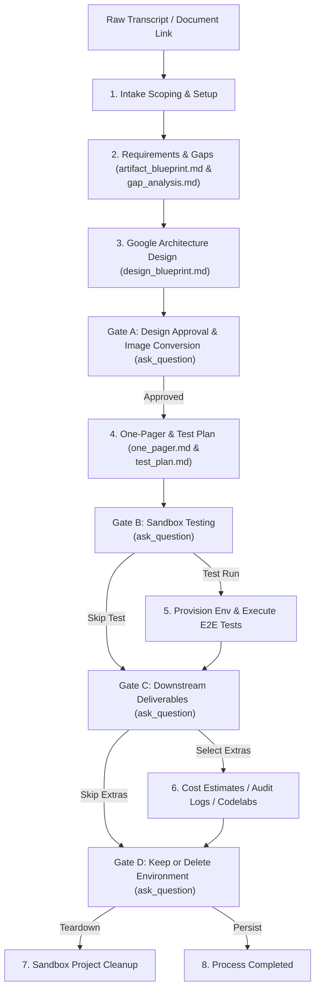

# Developer & Architect Guide: Customer Discovery & Solutions-Engineering Pipeline (`/extract-requirements`)

This document provides an exhaustive reference guide explaining the mechanics, underlying skills, prompts, lifecycle phases, and standards of the **`/extract-requirements`** workflow in the `ce-scale` repository.

---

## 1. Pipeline Architecture & Overview

The `/extract-requirements` workflow is an automated Solutions Engineering pipeline. It takes raw transcripts or document links and guides the architect sequentially through requirement scoping, gap analysis, blueprinting, manual approval, diagram generation, sandbox E2E testing, cost auditing, and environment teardown.

---

## 2. Mapped Underlying Skills

The workflow coordinates several specialized, workspace-level skills to guide the progressive execution:

### A. `extracting-requirements-from-meetings`
- **Target Artifact**: **Artifact Blueprint** (`artifact_blueprint.md`).
- **Core Focus**: Extracts the What, Why, How, When matrix along withObjections and Citations.

### B. `customer-gap-analysis`
- **Target Artifact**: **Knowledge Gap Analysis** (`gap_analysis.md`).
- **Core Focus**: Maps gaps in customer knowledge, blind spots, and operational training requirements.

### C. `customer-design-blueprint`
- **Target Artifact**: **Design Blueprint** (`design_blueprint.md`).
- **Core Focus**: Drafts detailed solutions architecture following Google Cloud Architecture Framework and embedding a styled Mermaid flow.

### D. `creating-gcp-diagrams` & `generate_image`
- **Target Action**: Converts the approved Design Blueprint's Mermaid code into a static, high-fidelity PNG image.

### E. `customer-one-pager`
- **Target Artifact**: **Customer One-Pager** (`one_pager.md`).
- **Core Focus**: Concise executive brief embedding the high-fidelity topology image diagram.

### F. `customer-test-plan`
- **Target Artifact**: **Test Plan** (`test_plan.md`).
- **Core Focus**: Simple internal verification test suite with gcloud/kubectl CLI command validation.

### G. Downstream Engineering Skills
- **`gcp-provisioning`**: Automated project creation & API enabling in Argolis.
- **`codelab-validation`**: E2E sandbox validation test execution.
- **`codelab-pricing-estimator`**: Hourly active sandbox cost audit.
- **`codelab_audit_logging`**: Fetch and format GCP sandbox audit logs.
- **`codelab-cleanup`**: Clean and delete provisioned projects.

---

## 3. Unified System Prompt: `discovery_analyst.md`

The single source of cognitive authority for requirements extraction and design is located in the workspace prompt repository:
👉 **[prompts/discovery_analyst.md](file:///Users/shacharb/Downloads/ce-scale/prompts/discovery_analyst.md)**

The agent loads this prompt and steers deliverable styles using specific flags:

| Formatting Flag | Target Template | Associated Skill |
| :--- | :--- | :--- |
| `--format blueprint` | Artifact Blueprint | `extracting-requirements-from-meetings` |
| `--format gap_analysis` | Knowledge Gap Analysis | `customer-gap-analysis` |
| `--format design_blueprint` | Design Blueprint | `customer-design-blueprint` |
| `--format one_pager` | Customer One-Pager | `customer-one-pager` |
| `--format test_plan` | Test Plan | `customer-test-plan` |

---

## 4. Multi-Phase Orchestration Lifecycle

Here is how the workflow progresses sequentially, incorporating interactive human-in-the-loop gates:

### Phase 1: Scope Intake & Initial Scoping
1. **Task Initiation**: Initialize `task.md` in the brain workspace. Set Step 1 to `RUNNING`.
2. **Extraction & Gap Mapping**: 
   - Generate `meeting/<customer_name>/artifact_blueprint.md` and `gap_analysis.md` in parallel from raw transcript.
   - Set Step 2 to `DONE`.

### Phase 2: Strategic Design Design
1. **Google Best Practices Alignment**: Query the `google-developer-documentation-mcp` server targeting the Google Cloud Architecture Framework.
2. **Design Architecture**: Generate `meeting/<customer_name>/design_blueprint.md` containing design logic and Mermaid flowchart.

### Phase 3: Gate A - Design Approval & Diagram Conversion
1. **Manual Approval**: Invoke **`ask_question`** to review and approve the design.
2. **Static PNG Diagram Generation**: Once approved, call `creating-gcp-diagrams` to convert the Mermaid flowchart to a high-fidelity PNG.

### Phase 4: Assembly & Test Scoping
1. **Deliverable Generation**: Write `one_pager.md` (linking the static PNG) and `test_plan.md` directly under `meeting/<customer_name>/`.
2. **Task Progression**: Mark Stage 4 `DONE`.

### Phase 5: Gate B - E2E Sandbox Testing
1. **Validation Gate**: Call **`ask_question`** asking if the user wants to run tests.
2. **Provision & Execute**: If yes, check credentials, provision sandbox project via `gcp-provisioning`, and run functional validation commands.

### Phase 6: Gate C - Downstream Delivery
1. **Advanced Delivery Gate**: Call **`ask_question`** presenting options for hourly cost estimation, validation logging, or official Codelab generation.
2. **Execute Options**: Invoke `codelab-pricing-estimator`, `codelab_audit_logging`, and/or `codelab-creation` based on selection.

### Phase 7: Gate D - Environmental Teardown
1. **Cleanup Gate**: Call **`ask_question`** asking whether to keep or delete the sandbox project.
2. **Teardown**: If delete, invoke `codelab-cleanup` to tear down resources. Update `task.md` to complete the process.

---

## 5. Gotchas & Operational Standards

> [!IMPORTANT]
> **State Management via task.md**
> Every single stage transition must update the unindented HTML `task.md` status and timestamps dynamically. Maintain all HTML flush left to ensure clean table rendering.

> [!TIP]
> **Dynamic GCP Architecture Framework Queries**
> During Design Blueprint creation, always query the framework guidelines. This ensures that we recommend the exact, enterprise-grade managed service configurations (e.g. Cloud SQL regional HA configurations) instead of generic assumptions.
