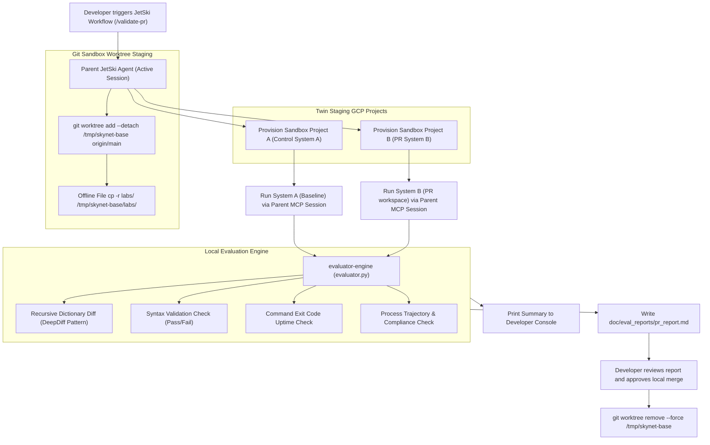

# System Design Document: Local E2E Prompt Evaluation Framework (JetSki Git Sandbox)
**Role Focus**: Systems Engineering, Quality Automation, & Sandbox-Native Tooling  
**Target Audience**: Core Development Team (2 Engineers - Pure Git & GitHub Environment)  
**Status**: APPROVED IMPLEMENTATION PLAN (LOCAL GIT WORKTREE NATIVE & TRAJECTORY AWARE)  

---

## 1. Context & Executive Summary

This document outlines the system design, architectural guardrails, trajectory metrics, elite hardening masterstrokes, and execution model for the **Local E2E Prompt Evaluation Framework** optimized for JetSki development within a **pure Git repository environment**.

### The JetSki Local Git Execution Model
Because multi-subagent workflows execute entirely inside JetSki on your local workstation, remote CI/CD runners cannot directly access your local sandbox environments. Therefore, the **developer initiates the evaluation locally** via a JetSki slash command (`/validate-pr`) and approves or merges the Pull Request based on the local grading output.

### Core Design Principles
1. **Git Worktree Parallel Staging**: The framework dynamically checks out the target base branch (e.g., `main`) in a temporary sandbox directory using `git worktree` to generate the control baseline (System A) and compares it to the active developer workspace (System B).
2. **Pragmatic Local Gates**: Bypasses remote CI/CD overhead in favor of a **JetSki-Native Workflow** (`/validate-pr`) orchestrating the E2E evaluation locally.
3. **Process Trajectory Observability**: Evaluates not just the final output artifacts, but the efficiency, stability, and compliance of the agent's execution path ($T_s$).

---

## 2. Architectural Blueprint (Local JetSki Git Flow)



---

## 3. Level 400 Advisory: Why This Will Fail & Operational Remedies

To ensure this local Git-worktree workflow is robust and execution-safe, address the following critical gotchas:

### 3.1. Git Worktree Best Practices & Pitfalls
> [!TIP]
> **Worktree Detached HEAD & Trapped State**  
> When automating `git worktree add`, always use the `--detach` flag pointing to `origin/main`. If you attach to a local branch name that is already checked out elsewhere, Git will throw a fatal lock error.

- **A. Pristine Checkout**: Execute `git worktree add --detach /tmp/skynet-base origin/main` to guarantee a clean, unconflicted control baseline.
- **B. Force Teardown**: Use `git worktree remove --force /tmp/skynet-base` in your cleanup block to ensure the temporary worktree unregisters cleanly even if uncommitted artifacts or pycache files were generated inside it.
- **C. The Gitignored Files Gotcha (Critical Stage Block)**:
  - **Why it fails**: Developer sandboxes frequently add dynamic testing folders to `.gitignore` (e.g., `labs/` or `meeting/` or `artifacts/`) to prevent dynamic runs from polluting the Git branch history.
  - **The Impact**: Because these directories are gitignored, Git worktree checkouts (`git worktree add`) **will NOT copy these directories into the staging folder `/tmp/skynet-base`!** Running a baseline validation inside the worktree will crash immediately on "File/Directory not found" errors because the guide files (e.g., `swp-basics.lab.md`) are missing!
  - **The Operational Fix**: The orchestrator must dynamically execute a manual, offline file copy command (`cp -r labs/ /tmp/skynet-base/labs/`) immediately after worktree creation to bridge Git-excluded guides into the isolated staging folder securely.

### 3.2. Workflow Parity & Subagent-Native MCP Pipes (Fidelity Block)
- **Why it fails**: 
  1. **Workflow Instruction Drifts**: If a developer modifies a workflow file (e.g., `.agents/workflows/create-codelab.md`) or a core skill file (e.g., under `.agents/skills/`), a simple static command run using the Parent's environment will **not** execute the branch-specific instructions. The baseline run (System A) must load and parse the workflows/skills *as they exist in `origin/main`*, while the candidate run (System B) must load and parse the *newly modified* workflows/skills.
  2. **MCP Socket Access**: Standalone subprocesses (`python3 core_orchestrator.py`) run outside the parent LLM/agent process loop. They lack the necessary environment variables, socket file descriptors, and IPC pipes required to communicate with authenticated Model Context Protocol (MCP) servers (`f1`, `plx`, `moma`, `workspace`). Subprocesses will immediately crash when attempting database or template searches.
- **The Hardening Fix**: Rather than spawning a raw background Python shell, the framework **spawns native JetSki Subagents (`invoke_subagent`) inside branch-isolated workspaces**:
  * **System A Control Subagent**: Spawns a dedicated subagent using `Workspace: "branch"` set to target `/tmp/skynet-base` directory, passing `enable_mcp_tools: true` and loading the baseline `.agents/workflows/` and skills under `/tmp/skynet-base/`.
  * **System B Candidate Subagent**: Spawns a dedicated subagent using `Workspace: "inherit"` (or branched for pristine isolation) pointing to the active workspace directory `/usr/local/google/home/shacharb/skynet`, also passing `enable_mcp_tools: true`.
  * **Result**: Since both run as native JetSki Subagents, **they automatically inherit full MCP socket channels and active gcloud sandbox permissions**, while loading and executing the *exact, branch-specific versions of workflows and skills* belonging to their respective workspace paths!


### 3.3. Project-Level GCP State Contamination (Cloud Collision Block)
- **Why it fails**: Running System A and System B concurrently or sequentially on the *same GCP sandbox project* will contaminate project-level global state. E.g., if System A enables `compute.googleapis.com`, System B will see it already enabled, masking latency and activation bugs.
- **The Hardening Fix**: The orchestrator dynamically **provisions two distinct temporary GCP sandbox projects** (`sysa-proj-123` and `sysb-proj-456`) using billing accounts, running System A and System B in complete cloud isolation.

### 3.4. Corporate Workstation Proxy Restrictions (Package Install Block)
- **Why it fails**: Internal Google Cloudtops block direct PyPI package installations.
- **The Hardening Fix**: Configure local venv installation hooks inside the checkouts to pull packages from internal Google python mirrors (`go/py-mirror` or corporate caches).

### 3.5. Context Contamination & Hermetic Isolation Guardrails (Cheating Block)
- **Why it fails**: During local execution, the agent under test possesses read tools (`read_file`, `grep_search`). If it scans your active workspace directory, it will "cheat" by discovering your PR modifications, breaking evaluation validity.
- **The Hardening Fix**:
  - **Workspace Branching**: Spawn subagents with the **`Workspace: "branch"`** option.
  - **Blacklisting**: Disable tool access to `/doc/eval_reports/`, `/tmp/system_*`, or `task.md` inside the test prompts.
  - **Parameter Randomization**: Perturb VPC names, IP ranges, and regions using predefined validated pools at runtime to force active logical thinking.

---

## 4. Core Component Specifications

### 4.1. The `prompt-standardizer` Subagent
- **Role**: Formulates natural-language requests into standard command sequences.
- **Configuration**: 
  - Runs with `temperature: 0.0` for total determinism.
  - Constrained to structured JSON output schema so that outputs can be copied and compared without formatting drift.

### 4.2. The `evaluator-engine` Skill (`evaluator.py`)
A standard-library Python script that compares output directories recursively and parses step history logs to calculate grading metrics:
1. **Syntax Checking**: Validates parser compatibility of output configurations.
2. **Structural Differences**: Employs recursive dictionary diffing (`deepdiff`) to track nested additions, removals, and modifications.
3. **Uptime Reliability**: Confirms all local test runner execution commands completed with exit code `0`.
4. **Process Trajectory Scoring**: Analyzes execution histories to grade gate compliance, tool efficiency, and path stability.

---

## 5. Detailed Quality, Determinism & Process Metrics

### 5.1. Quality Grade ($Q_s$)
$$Q_s = 0.3 \cdot S_{syntax} + 0.4 \cdot S_{security} + 0.3 \cdot S_{completeness}$$

### 5.2. Determinism Coefficient ($D_{a,b}$)
$$D_{a,b} = \frac{\text{Shared Files without Structural Drift}}{\text{Total Shared Files}}$$

### 5.3. Uptime Reliability ($R$)
$$R = 1 - \left( \frac{\text{Failed Commands}}{\text{Total Executed Commands}} \right)$$

### 5.4. Process Trajectory & Efficiency Rating ($T_s$)
The Trajectory Score ($T_s$) measures **execution process efficiency, stability, and compliance** during the prompt run, calculated as:

$$T_s = w_c \cdot S_{compliance} + w_e \cdot S_{efficiency} + w_s \cdot S_{stability}$$

Where:
- **Gate Compliance ($S_{compliance}$)**: Bypassing Strategy Sign-off Gate or Blueprint Gate triggers an instant failure ($S_{compliance} = 0.0$).
- **Tool Efficiency ($S_{efficiency}$)**: Penalizes the agent for self-healing bug counts:
  $$S_{efficiency} = \frac{1}{1 + 0.2 \cdot N_{bugs}}$$
- **Logical Path Stability ($S_{stability}$)**: Tracks backtracking actions:
  $$S_{stability} = \frac{\text{Ideal Structural Steps}}{\text{Actual Structural Steps Taken}}$$

---

## 6. JetSki Workflow Specification (`/validate-pr`)

The custom JetSki workflow coordinates the end-to-end evaluation locally. When the developer enters `👉 /validate-pr`, the agent executes the following lifecycle:

```yaml
workflow: validate-pr
description: "Executes local E2E twin evaluation comparing active Git workspace against origin/main base branch."
steps:
  - name: Local Pre-flight Checks & Sterile State Pruning
    action: |
      1. Verify active gcloud credentials and check for uncommitted file collisions.
      2. Delete local tester_state caches: rm -rf .tester_state/
      3. Clear pycache and transient files.

  - name: Git Worktree Sandbox Isolation
    action: "Execute git worktree add --detach /tmp/skynet-base origin/main."

  - name: Staging Gitignored Codelabs
    action: "Execute cp -r labs/ /tmp/skynet-base/labs/ to bridge ignored markdown guides."

  - name: Twin GCP Sandboxes Provisioning
    action: |
      1. Provision GCP Project A for Control System A run.
      2. Provision GCP Project B for Candidate System B run.

  - name: System A Control Run (Base Code)
    action: |
      1. Spawn a native JetSki Subagent using Workspace: "branch" pointing to "/tmp/skynet-base".
      2. Pass "enable_mcp_tools: true" to authorize access to f1, plx, moma, and workspace.
      3. Direct the subagent to execute the golden prompt suite using the project-id "sysa-proj-123".
      4. Save System A results to "/tmp/system_a_outputs".

  - name: System B Workspace Run (Candidate Code)
    action: |
      1. Spawn a native JetSki Subagent using Workspace: "inherit" (or "branch" to isolate uncommitted local state).
      2. Pass "enable_mcp_tools: true" to authorize access to f1, plx, moma, and workspace.
      3. Direct the subagent to execute the golden prompt suite using the project-id "sysb-proj-456".
      4. Save System B results to "/tmp/system_b_outputs".


  - name: Evaluator Engine Execution (Trajectory Scoring)
    action: "Invoke evaluator.py comparing /tmp/system_a_outputs and /tmp/system_b_outputs."

  - name: Reporting & UI Rendering
    action: |
      1. Write detailed markdown report to doc/eval_reports/pr_report.md.
      2. Stream summary diff table directly to JetSki chat console.

  - name: Sandbox Teardown & Cleanup
    action: |
      1. Cleanup both GCP Projects via sandbox_cleanup.py.
      2. Execute git worktree remove --force /tmp/skynet-base.
```

---

## 7. Division of Labor (Updated 2-Person MVP Plan)

### Developer 1: The Local Git Staging & Workflow
- [ ] Implement `/validate-pr` workflow in `.agents/workflows/validate-pr.md`.
- [ ] Implement parent-coordinated sequential runs inside `core_orchestrator.py` and double-project sandboxing in `sandbox_cleanup.py`.
- [ ] Implement pristine `git worktree add --detach` and `git worktree remove --force` automation, along with dynamic copying of ignored directories.
- [ ] Configure `tester.py` to export step history logs `tester_history.json`.

### Developer 2: The Evaluator & Standardizer Engine
- [x] Create `evaluator.py` with recursive standard library dictionary diffing.
- [x] Register the custom `evaluator-engine` skill.
- [x] Formulate standardized, structured JSON outputs for golden prompts.
- [ ] **Next Step**: Integrate Trajectory & Efficiency parser logic inside `evaluator.py` to parse `tester_history.json` and check Phase compliance.

---

## 8. L6 Tech Lead Pre-Mortem & Hardening (HITL Gate)

### 8.1. The Pre-Mortem Blindspots
- **The Perturbation Explosion (Fragile Randomization)**: Restrict randomization parameters to pre-validated arrays of known-good variables (**Contract-Based Parameter Pools**).
- **The Silent Cloud Timeout (Transient Latency)**: Wrap live cloud executions in Python retry libraries (`tenacity`) with exponential backoffs.
- **The Structural Diff False Alarm (Benign Refactoring)**: Execute pre-filtering passes stripping non-functional metadata (timestamps, credentials, list order).
- **The Trajectory Parser Fragility**: Wrap parser code in a robust defensive `try-except` block to log warnings instead of crashing.

### 8.2. The Human-in-the-Loop (HITL) "Judge & Override" Gate
Automation excels at structural deltas, but humans excel at determining *intent*. If the quality gate fails due to a benign refactoring, the developer reviews `doc/eval_reports/pr_report.md` and issues a force override:
```text
👉 /merge-pr --force --reason="Benign structural tag refactoring"
```
This keeps your quality gate strict while empowering developer common sense to unblock false alarms instantly.
