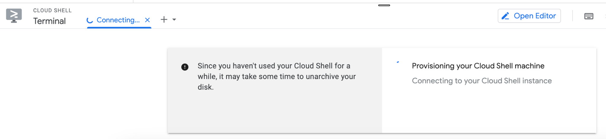
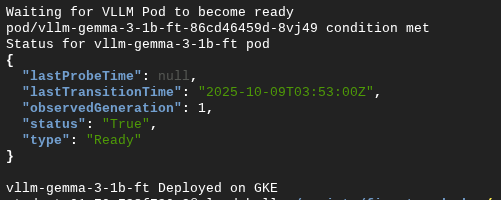
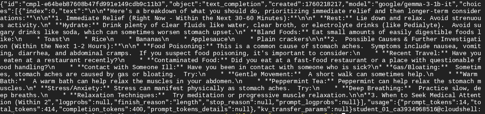
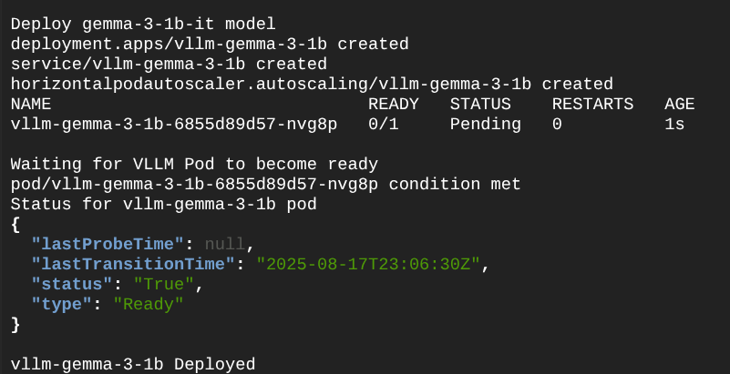

# Integrate Self-hosted LLM on TPU in Your App

## 1. Introduction
Duration: 02:00

Managing LLM serving latency, throughput, and deployment costs is key for enterprise AI applications. Deploying open models like Gemma 3 on dedicated Google Kubernetes Engine (GKE) TPU clusters provides ultimate infrastructure control, high throughput, and cost optimization.

In this lab, you will learn how to integrate a self-hosted LLM running on a GKE TPU cluster into a real-world sample application. The sample application features a dynamic backend that can seamlessly transition between standard public LLM models on Vertex AI, custom fine-tuned models on Vertex AI Endpoints, or self-hosted models running on GKE.

### What you will learn
* Automate the deployment of an LLM (Gemma-3-1b-it) on GKE using the `gcloud` CLI.
* Validate and test the GKE Inference endpoints using `curl` and Cloud Shell.
* Configure and integrate GKE Inference endpoints into the backend of the sample application.
* Run and test the frontend application locally, and optionally deploy it to Cloud Run.

### Prerequisites
* A Google Cloud project with billing enabled.
* Access to Google Cloud Shell and Cloud Shell Editor.
* A [Hugging Face](https://huggingface.co/) account and an Access Token (with Write permissions) to download Gemma 3 models.

---

## 2. Setup and Requirements
Duration: 05:00

### Self-paced environment setup
1.  Sign-in to the [Google Cloud Console](https://console.cloud.google.com/) and create a new project or reuse an existing one. (If you don't already have a Gmail or Google Workspace account, you will need to [create one](https://accounts.google.com/SignUp).)

    *   The **Project name** is the display name for this project's participants. It is a character string not used by Google APIs. You can update it at any time.
    *   The **Project ID** is unique across all Google Cloud projects and is immutable (cannot be changed after it has been set). The Cloud Console auto-generates a unique string; usually you don't care what it is. In most codelabs, you'll need to reference the Project ID (it's typically identified as `PROJECT_ID`). If you don't like the generated ID, you may generate another random one. Alternatively, you can try your own, and see if it's available. It cannot be changed after this step and remains for the duration of the project.
    *   For your information, there is a third value, a **Project Number**, which some APIs use. Learn more about all three of these values in the [documentation](https://cloud.google.com/resource-manager/docs/creating-managing-projects#identifying_projects).

2.  Next, you'll need to enable billing in the Cloud Console to use Cloud resources/APIs. Running through this codelab shouldn't cost much, if anything at all. To shut down resources to avoid incurring billing beyond this tutorial, you can delete the resources you created or delete the whole project. New users of Google Cloud are eligible for the [$300 USD Free Trial](https://cloud.google.com/free) program.

### Activate Cloud Shell
1.  From the Cloud Console, click **Activate Cloud Shell** .

2.  If you've never started Cloud Shell before, you're presented with an intermediate screen describing what it is. If that's the case, click **Continue**.

3.  It should only take a few moments to provision and connect to Cloud Shell.

    The virtual machine is loaded with all the development tools you'll need. It offers a persistent 5GB home directory, and runs on the Google Cloud, greatly enhancing network performance and authentication. All of your work in this codelab can be done within the browser.

4.  Once connected to Cloud Shell, you should see that you are already authenticated and that the project is set to your `PROJECT_ID`.

    ```bash
    gcloud auth list
    ```

    **Command output**
    ```console
    Credentialed accounts:
     - <myaccount>@<mydomain>.com (active)
    ```

    ```bash
    gcloud config list project
    ```

    **Command output**
    ```console
    [core]
    project = <PROJECT_ID>
    ```

    **Note:** If the project is not set, you can set it with this command:
    ```bash
    gcloud config set project <PROJECT_ID>
    ```

---

## 3. Deploy Gemma Model on TPU
Duration: 25:00

First, you will copy the TPU deployment scripts into your home directory and configure the environment variables for the deployment script.

1. Open **Cloud Shell** and run the following commands to copy the GKE deployment scripts from the pre-provisioned gsutil bucket:
```bash
export PROJECT_ID=$(gcloud config get-value project)
export REGION="us-central1" # Or your preferred region supporting TPU v6e/v5e

gsutil cp -r gs://$PROJECT_ID/scripts ~/
cd ~/scripts/fine-tuned-tpu/
cp .env.example .env
```

2. Use the Cloud Shell Editor or `nano`/`vi` to edit the `.env` file:
```bash
nano .env
```

3. Configure the `.env` file parameters. Populate the fields with your specific project information:
```text
PROJECT_ID=<YOUR_PROJECT_ID>
REGION=<YOUR_GCP_REGION>
PROJECT_NUMBER=<YOUR_PROJECT_NUMBER>
MODEL_BUCKET=<YOUR_PROJECT_ID>
KSA_NAME="tpu-ksa"
CLUSTER_NAME="tpu-gke-cluster"
MODEL_PATH="google/gemma-3-1b-it" # Or the Hugging Face identifier of your model
```
*(Note: You can retrieve your Project Number by running `gcloud projects describe $(gcloud config get-value project) --format='value(projectNumber)'` in another Cloud Shell terminal).*



4. Make the deployment script executable and run it to deploy the Gemma 3 model on TPU:
```bash
chmod +x deploy-gemma-3-1b-ft-to-tpu.sh
./deploy-gemma-3-1b-ft-to-tpu.sh
```



> [!NOTE]
> The deployment script automates provisioning of GKE resources, setup of TPU node pools, and deployment of the model serving container. This process will take approximately **20 minutes** to complete. While the script is running, you can proceed with the next sections to download the application.

---

## 4. Get the LLM Inference Endpoint
Duration: 05:00

Once the GKE deployment script completes, the model serving endpoint will be exposed via a Kubernetes Service with an External IP.

1. Verify the Kubernetes services in your GKE cluster:
```bash
kubectl get service
```

You should see output similar to:
```console
NAME          TYPE           CLUSTER-IP    EXTERNAL-IP     PORT(S)             AGE
kubernetes    ClusterIP      10.96.0.1     <none>          443/TCP             25m
llm-service   LoadBalancer   10.96.0.100   34.123.45.67    8000:31056/TCP      5m
```


2. Extract and set the GKE Inference Endpoint using the `EXTERNAL-IP` shown in the output:
```bash
export GKE_INFERENCE_ENDPOINT="http://34.123.45.67:8000"
```

3. Validate that the inference endpoint is active and responding by running a quick `curl` completion query in Cloud Shell:
```bash
export USER_PROMPT="I am suffering from a stomach ache. What should I do?"

curl -X POST $GKE_INFERENCE_ENDPOINT/v1/completions \
  -H "Content-Type: application/json" \
  -d @- <<EOF
{
    "prompt": "${USER_PROMPT}",
    "temperature": 0.1,
    "top_p": 1.0,
    "max_tokens": 512
}
EOF
```

You should receive a valid JSON response containing the generated answer from your self-hosted Gemma 3 model!



---

## 5. Prepare the Demo Application
Duration: 05:00

Next, you will download the backend demo application code and configure its environment variables.

1. Open a new Cloud Shell terminal window or panel.
2. Copy the application directories from the project's gsutil storage bucket:
```bash
export PROJECT_ID=$(gcloud config get-value project)
gsutil cp -r gs://$PROJECT_ID/apps ~/
cd ~/apps/intelli-demo-app
cp .env.example .env
```

3. Edit the application `.env` file:
```bash
nano .env
```

4. Populate the configuration parameters with your project details and GKE inference endpoint URL:
```text
# Generic Configuration
PROJECT_ID=<YOUR_PROJECT_ID>
REGION=<YOUR_GCP_REGION>

# GKE as model backend
GKE_INFERENCE_ENDPOINT_URL="http://<YOUR_GKE_INFERENCE_IP>:8000/v1/chat/completions"
```
*(Make sure to include the `/v1/chat/completions` suffix in the endpoint URL).*

---

## 6. Run the Application Locally
Duration: 07:00

To test the application, you will set up a Python virtual environment, install dependencies, authenticate, and launch the local server.

1. Create a Python virtual environment and activate it:
```bash
python3 -m venv .venv
source .venv/bin/activate
```

2. Install the required application dependencies:
```bash
pip install -r src/requirements.txt
```

3. Authenticate your shell environment to allow the application to interact with Vertex AI and other Google Cloud resources under your sandbox profile:
```bash
gcloud auth application-default login
```

Follow the interactive browser prompt to sign in.

4. Start the local Python server:
```bash
python src/app.py
```

You should see output in your terminal similar to:
```console
Running on local URL:  http://127.0.0.1:7860
```

5. In Cloud Shell, click the **Web Preview** button and select **Preview on port 7860** to open the chat application interface in a new tab.
6. Select the **GKE (Self-hosted)** model backend option and submit a prompt (e.g. "Hello, Gemma!"). The backend will route the request directly to your self-hosted TPU cluster!

---

## 7. Deploy the Application to Cloud Run (Optional)
Duration: 08:00

If you want to share your application externally, you can containerize and deploy it serverlessly onto Cloud Run.

1. Grant the default Compute Engine service account the necessary permissions to call the Vertex APIs and interact with Google Cloud:
```bash
export PROJECT_ID=$(gcloud config get-value project)

gcloud projects add-iam-policy-binding $PROJECT_ID \
    --member="serviceAccount:$(gcloud projects describe $PROJECT_ID --format='value(projectNumber)')-compute@developer.gserviceaccount.com" \
    --role="roles/aiplatform.user"
```

2. Deploy the application service using the `gcloud run deploy` command:
```bash
source .env

gcloud run deploy intelli-demo-app-service \
  --source ./src \
  --region $REGION \
  --port 7860 \
  --allow-unauthenticated \
  --set-env-vars=GKE_INFERENCE_ENDPOINT_URL=$GKE_INFERENCE_ENDPOINT_URL,PROJECT_ID=$PROJECT_ID
```



3. After the deployment completes, run the following command to retrieve the public URL of your Cloud Run deployment:
```bash
gcloud run services describe intelli-demo-app-service \
  --platform managed \
  --region $REGION \
  --format 'value(status.url)'
```

4. Visit the returned URL in your browser to interact with your live, serverless web application powered by GKE TPU backends!

---

## 8. Congratulations
Duration: 01:00

Congratulations! You have successfully integrated a self-hosted Gemma 3 model running on a high-performance GKE TPU cluster into an interactive enterprise-ready sample web application, and deployed the app to Cloud Run!

### What you have accomplished
* Automated GKE TPU resource serving and serving configurations via Cloud Shell.
* Verified GKE serving interfaces with curl.
* Connected the frontend application to a custom GKE model endpoint.
* Deployed a highly scalable web server using Cloud Run.

### Next Steps
* Learn more about [About AI/ML model inference on GKE](https://cloud.google.com/kubernetes-engine/docs/concepts/inference).
* Subscribe to the [Google Cloud Tech YouTube Channel](https://www.youtube.com/user/googlecloudplatform) for up-to-date guides and cloud architectures.
