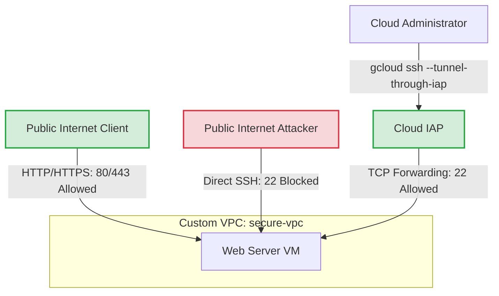

# Blueprint: VPC Firewall Protection & Secure IAP SSH

## Target Audience
Developers / Fast Learners

## Objective
Demonstrate how to secure a public-facing Google Cloud web server using VPC firewall rules. The configuration permits inbound HTTP/HTTPS web traffic from the public internet while strictly blocking direct public SSH access, allowing administrative SSH connections exclusively through Identity-Aware Proxy (IAP) TCP forwarding.

## Concrete Outcomes
The user will deploy and verify:
1. **Custom VPC Network & Subnet**: A dedicated network (`secure-vpc`) with a custom subnet (`web-subnet`).
2. **VPC Firewall Rules**:
   - `allow-web-traffic`: Ingress rule permitting TCP ports 80 and 443 from `0.0.0.0/0` targeting tagged instances.
   - `allow-iap-ssh`: Ingress rule permitting TCP port 22 exclusively from Google Cloud IAP's forwarding range (`35.235.240.0/20`).
3. **Compute Engine Web Server**: An `e2-micro` instance running Apache web server provisioned via startup script with target tag `web-server`.

## Architecture Topology


## Deployment Steps (Gradual Complexity)

### Step 1: Base Infrastructure Setup
- Enable required Google Cloud APIs:
  ```bash
  gcloud services enable compute.googleapis.com
  ```
- Create custom VPC network:
  ```bash
  gcloud compute networks create secure-vpc --subnet-mode=custom
  ```
- Create subnet in `us-central1`:
  ```bash
  gcloud compute networks subnets create web-subnet \
      --network=secure-vpc \
      --region=us-central1 \
      --range=10.0.1.0/24
  ```

### Step 2: Configure VPC Firewall Rules
- Create firewall rule to allow HTTP/HTTPS traffic from anywhere:
  ```bash
  gcloud compute firewall-rules create allow-web-traffic \
      --network=secure-vpc \
      --allow=tcp:80,tcp:443 \
      --direction=INGRESS \
      --source-ranges=0.0.0.0/0 \
      --target-tags=web-server \
      --description="Allow incoming HTTP/HTTPS web traffic"
  ```
- Create firewall rule to allow SSH access exclusively via Cloud IAP TCP forwarding:
  ```bash
  gcloud compute firewall-rules create allow-iap-ssh \
      --network=secure-vpc \
      --allow=tcp:22 \
      --direction=INGRESS \
      --source-ranges=35.235.240.0/20 \
      --target-tags=web-server \
      --description="Allow SSH access from Cloud IAP range"
  ```

### Step 3: Provision Target Web Server
- Create a Compute Engine VM instance tagged with `web-server` and equipped with an Apache startup script:
  ```bash
  gcloud compute instances create web-server-vm \
      --zone=us-central1-a \
      --machine-type=e2-micro \
      --network=secure-vpc \
      --subnet=web-subnet \
      --tags=web-server \
      --metadata=startup-script='#! /bin/bash
  apt-get update
  apt-get install -y apache2
  cat <<EOF > /var/www/html/index.html
  <html><body><h1>Secure Web Server Protected by VPC Firewall & IAP!</h1></body></html>
  EOF'
  ```

## Verification Strategy

### 1. Verify Public Web Access (Positive Testing)
Retrieve the external IP address of the VM instance and verify HTTP access using `curl`:
```bash
EXTERNAL_IP=$(gcloud compute instances describe web-server-vm \
    --zone=us-central1-a \
    --format='get(networkInterfaces[0].accessConfigs[0].natIP)')

curl http://$EXTERNAL_IP
```
*Expected Output*: Displays the custom HTML page served by Apache.

### 2. Verify Secure SSH via IAP (Positive Testing)
Establish an SSH session using the `--tunnel-through-iap` flag:
```bash
gcloud compute ssh web-server-vm \
    --zone=us-central1-a \
    --tunnel-through-iap \
    --command="hostname; echo 'Successfully connected via IAP tunnel!'"
```
*Expected Output*: Successfully connects, prints the hostname, and outputs the confirmation message.

### 3. Verify Direct Public SSH is Blocked (Negative Testing)
Attempt to SSH directly to the external IP address without IAP tunneling to prove the firewall blocks unauthorized access:
```bash
ssh -o ConnectTimeout=5 -i ~/.ssh/google_compute_engine $(whoami)@$EXTERNAL_IP
```
*Expected Output*: Connection times out, verifying that TCP port 22 is successfully shielded from the public internet.
