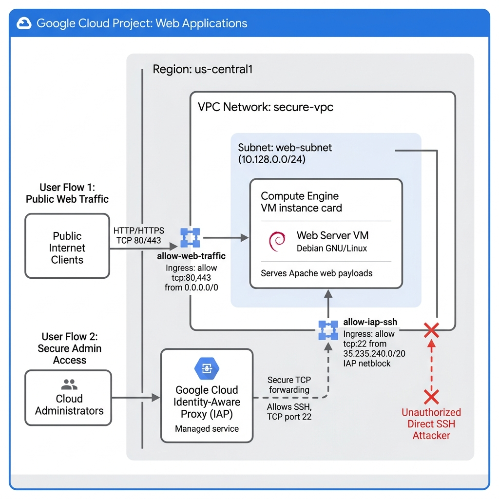

# Secure Web Server with VPC Firewalls and IAP SSH

## 1. Introduction
Duration: 02:00

Securing public-facing infrastructure is a foundational requirement for any cloud deployment. Exposing administrative ports like SSH (port 22) directly to the public internet invites continuous port scans and brute-force login attempts. 

In this codelab, you will implement a highly secure network topology using Google Cloud Virtual Private Cloud (VPC) firewall rules. You will deploy an Apache web server that permits inbound HTTP and HTTPS web traffic from anywhere while strictly blocking direct public SSH access. To maintain administrative access without compromising security, you will configure firewall rules to allow SSH connections exclusively through Identity-Aware Proxy (IAP) TCP forwarding.

### Architecture Topology


### What you'll do
- Create a custom VPC network and a dedicated subnet.
- Configure a VPC firewall rule to allow inbound HTTP and HTTPS web traffic from the public internet.
- Configure a VPC firewall rule to allow SSH access exclusively from the Google Cloud IAP forwarding range.
- Deploy a Compute Engine virtual machine running an Apache web server using a startup script.
- Verify public web serving capabilities.
- Verify secure administrative access using IAP tunneling.
- Perform negative testing to confirm direct public SSH access is successfully blocked.

### What you'll need
- A modern web browser.
- A Google Cloud project with billing enabled.
- Basic familiarity with the Linux command line.

Audience: Developers, System Administrators, and Cloud Architects seeking practical experience with secure networking boundaries and Identity-Aware Proxy.

## 2. Setup and Requirements
Duration: 05:00

### Self-paced environment setup
1.  Sign-in to the [Google Cloud Console](https://console.cloud.google.com/) and create a new project or reuse an existing one. (If you don't already have a Gmail or Google Workspace account, you will need to [create one](https://accounts.google.com/SignUp).)

    *   The **Project name** is the display name for this project's participants. It is a character string not used by Google APIs. You can update it at any time.
    *   The **Project ID** is unique across all Google Cloud projects and is immutable (cannot be changed after it has been set). The Cloud Console auto-generates a unique string; usually you don't care what it is. In most codelabs, you'll need to reference the Project ID (it's typically identified as `PROJECT_ID`). If you don't like the generated ID, you may generate another random one. Alternatively, you can try your own, and see if it's available. It cannot be changed after this step and remains for the duration of the project.
    *   For your information, there is a third value, a **Project Number**, which some APIs use. Learn more about all three of these values in the [documentation](https://cloud.google.com/resource-manager/docs/creating-managing-projects#identifying_projects).

2.  Next, you'll need to enable billing in the Cloud Console to use Cloud resources/APIs. Running through this codelab shouldn't cost much, if anything at all. To shut down resources to avoid incurring billing beyond this tutorial, you can delete the resources you created or delete the whole project. New users of Google Cloud are eligible for the [$300 USD Free Trial](https://cloud.google.com/free) program.

### Activate Cloud Shell
1.  From the Cloud Console, click **Activate Cloud Shell** .

2.  If you've never started Cloud Shell before, you're presented with an intermediate screen describing what it is. If that's the case, click **Continue**.

3.  It should only take a few moments to provision and connect to Cloud Shell.

    The virtual machine is loaded with all the development tools you'll need. It offers a persistent 5GB home directory, and runs on the Google Cloud, greatly enhancing network performance and authentication. All of your work in this codelab can be done within the browser.

4.  Once connected to Cloud Shell, you should see that you are already authenticated and that the project is set to your `PROJECT_ID`.

    ```bash
    gcloud auth list
    ```

    **Command output**
    ```
    Credentialed accounts:
     - <myaccount>@<mydomain>.com (active)
    ```

    ```bash
    gcloud config list project
    ```

    **Command output**
    ```
    [core]
    project = <PROJECT_ID>
    ```

    **Note:** If the project is not set, you can set it with this command:
    ```bash
    gcloud config set project <PROJECT_ID>
    ```

## 3. Base Infrastructure Setup
Duration: 03:00

To establish a clean, isolated networking environment, we will enable the necessary Compute Engine API and provision a custom VPC network with a dedicated subnet.

First, ensure the Compute Engine API is enabled in your project:

```bash
gcloud services enable compute.googleapis.com
```

> aside positive
> Enabling APIs can take a minute to propagate if this is the first time activating them in the project.

Create a custom VPC network named `secure-vpc`. Using custom subnet mode gives us absolute control over IP address ranges:

```bash
gcloud compute networks create secure-vpc --subnet-mode=custom
```

You should see output confirming successful creation similar to:
```
Created [https://www.googleapis.com/compute/v1/projects/PROJECT_ID/global/networks/secure-vpc].
NAME        SUBNET_MODE  BGP_ROUTING_MODE  IPV4_RANGE  GATEWAY_IPV4
secure-vpc  CUSTOM       REGIONAL
```

Next, create a subnet named `web-subnet` inside the `us-central1` region with a designated IP address range:

```bash
gcloud compute networks subnets create web-subnet \
    --network=secure-vpc \
    --region=us-central1 \
    --range=10.0.1.0/24
```

Expected output:
```
Created [https://www.googleapis.com/compute/v1/projects/PROJECT_ID/regions/us-central1/subnets/web-subnet].
NAME        REGION       NETWORK     RANGE
web-subnet  us-central1  secure-vpc  10.0.1.0/24
```

## 4. Configure VPC Firewall Rules
Duration: 05:00

By default, custom VPC networks block all ingress (incoming) traffic. We must explicitly create firewall rules to permit authorized communication.

### Allow Public Web Traffic
Create an ingress rule permitting TCP ports 80 (HTTP) and 443 (HTTPS) from any source IP address (`0.0.0.0/0`). We apply this rule selectively to instances possessing the network tag `web-server`:

```bash
gcloud compute firewall-rules create allow-web-traffic \
    --network=secure-vpc \
    --allow=tcp:80,tcp:443 \
    --direction=INGRESS \
    --source-ranges=0.0.0.0/0 \
    --target-tags=web-server \
    --description="Allow incoming HTTP/HTTPS web traffic"
```

Expected output:
```
Creating firewall...done.
NAME               NETWORK     DIRECTION  PRIORITY  ALLOW            DENY  EXECUTED
allow-web-traffic  secure-vpc  INGRESS    1000      tcp:80,tcp:443
```

### Allow Secure SSH via Cloud IAP
Instead of exposing port 22 to the public internet, we configure a firewall rule that restricts inbound SSH connections exclusively to Google Cloud's Identity-Aware Proxy forwarding infrastructure range (`35.235.240.0/20`):

```bash
gcloud compute firewall-rules create allow-iap-ssh \
    --network=secure-vpc \
    --allow=tcp:22 \
    --direction=INGRESS \
    --source-ranges=35.235.240.0/20 \
    --target-tags=web-server \
    --description="Allow SSH access exclusively from Cloud IAP range"
```

Expected output:
```
Creating firewall...done.
NAME           NETWORK     DIRECTION  PRIORITY  ALLOW   DENY  EXECUTED
allow-iap-ssh  secure-vpc  INGRESS    1000      tcp:22
```

> aside positive
> **Best Practice**: The IP block `35.235.240.0/20` is globally reserved by Google Cloud for IAP TCP forwarding. Restricting SSH access to this source range ensures that authenticated users can access instances securely without requiring external IP addresses or exposing administrative ports to unauthorized public access.

## 5. Provision Target Web Server
Duration: 05:00

Now we will deploy a Compute Engine virtual machine to act as our web server. We will attach the `web-server` network tag to apply our firewall rules automatically and use a startup script to install the Apache web server.

To minimize errors and formatting issues, create the startup script file locally in Cloud Shell using a copy-pasteable block:

```bash
cat << 'EOF' > startup.sh
#! /bin/bash
apt-get update
apt-get install -y apache2
cat <<HTML > /var/www/html/index.html
<html>
  <head><title>Secure Web Server</title></head>
  <body style="font-family: sans-serif; text-align: center; padding-top: 50px;">
    <h1 style="color: #1a73e8;">Protected Web Server Successfully Deployed!</h1>
    <p>This instance accepts HTTP traffic from anywhere, but restricts SSH access strictly to Identity-Aware Proxy (IAP).</p>
  </body>
</html>
HTML
EOF
```

Deploy the virtual machine instance utilizing our newly created startup script:

```bash
gcloud compute instances create web-server-vm \
    --zone=us-central1-a \
    --machine-type=e2-micro \
    --network=secure-vpc \
    --subnet=web-subnet \
    --tags=web-server \
    --metadata-from-file=startup-script=startup.sh
```

Expected output:
```
Created [https://www.googleapis.com/compute/v1/projects/PROJECT_ID/zones/us-central1-a/instances/web-server-vm].
NAME           ZONE           MACHINE_TYPE  PREEMPTIBLE  INTERNAL_IP  EXTERNAL_IP     STATUS
web-server-vm  us-central1-a  e2-micro                   10.0.1.2     34.123.45.67    RUNNING
```

> aside negative
> **Note**: Startup scripts run asynchronously during the instance boot process. Wait 2 to 3 minutes for package installation and Apache configuration to complete fully before proceeding to validation steps.

## 6. Verify Public Web Access
Duration: 03:00

Let's verify that our web server successfully accepts standard HTTP requests from the public internet.

Extract the external IP address of the virtual machine programmatically to streamline testing:

```bash
export EXTERNAL_IP=$(gcloud compute instances describe web-server-vm \
    --zone=us-central1-a \
    --format='get(networkInterfaces[0].accessConfigs[0].natIP)')

echo "Target Web Server IP: $EXTERNAL_IP"
```

Query the web server using `curl`:

```bash
# Startup scripts execute asynchronously. Wait up to 3 minutes for Apache initialization.
for i in {1..12}; do
  if curl -s -f http://$EXTERNAL_IP > /dev/null; then
    echo "Web server is up and serving content!"
    break
  fi
  echo "Waiting for web server to initialize (attempt $i/12)..."
  sleep 15
done

curl http://$EXTERNAL_IP
```

You should see output displaying our custom webpage confirming successful web serving:

```html
<html>
  <head><title>Secure Web Server</title></head>
  <body style="font-family: sans-serif; text-align: center; padding-top: 50px;">
    <h1 style="color: #1a73e8;">Protected Web Server Successfully Deployed!</h1>
    <p>This instance accepts HTTP traffic from anywhere, but restricts SSH access strictly to Identity-Aware Proxy (IAP).</p>
  </body>
</html>
```

## 7. Verify Secure SSH via IAP
Duration: 03:00

With standard web serving confirmed, let's validate secure administrative SSH access. 

Establish an SSH session leveraging the `--tunnel-through-iap` flag. This instructs the gcloud CLI to route traffic securely over Google's global infrastructure using IAP TCP forwarding:

```bash
gcloud compute ssh web-server-vm \
    --zone=us-central1-a \
    --tunnel-through-iap \
    --command="hostname; echo 'Successfully connected via secure IAP tunnel!'"
```

> aside positive
> If prompted to update host keys or verify identity, type `Y` or press Enter to confirm.

Expected output confirming secure session establishment:
```
web-server-vm
Successfully connected via secure IAP tunnel!
```

## 8. Negative Testing: Direct SSH Blocked
Duration: 03:00

A critical phase of enterprise validation is **negative testing**—proving that security mechanisms successfully deny unauthorized actions.

Attempt to establish a standard direct SSH connection targeting the instance's external IP address on TCP port 22 without using IAP tunneling:

```bash
ssh -o ConnectTimeout=5 -i ~/.ssh/google_compute_engine $(whoami)@$EXTERNAL_IP || echo "Connection timed out as expected."
```

Expected output:
```
ssh: connect to host 34.123.45.67 port 22: Connection timed out
```

> aside positive
> **Success**: The connection timeout proves that our VPC firewall configuration effectively drops unsolicited direct SSH packets from the public internet, insulating the instance from automated port scans and brute-force exploits.

## 9. Clean up
Duration: 05:00

To avoid ongoing charges to your Google Cloud account, delete the resources created during this tutorial. Execute the following commands to tear down the infrastructure cleanly.

Delete the web server virtual machine instance:

```bash
gcloud compute instances delete web-server-vm --zone=us-central1-a --quiet
```

Delete the custom VPC firewall rules:

```bash
gcloud compute firewall-rules delete allow-web-traffic allow-iap-ssh --quiet
```

Delete the custom subnet:

```bash
gcloud compute networks subnets delete web-subnet --region=us-central1 --quiet
```

Delete the custom VPC network:

```bash
gcloud compute networks delete secure-vpc --quiet
```

Finally, remove the local startup script file:

```bash
rm -f startup.sh
```

## 10. Congratulations
Duration: 01:00

Congratulations! You have successfully secured a public web server using Virtual Private Cloud firewall boundaries and Cloud Identity-Aware Proxy.

### What you've learned
- How to design custom VPC networks and granular subnets.
- How to permit public access for web workloads while isolating administrative endpoints.
- How to restrict SSH traffic to authorized Google Cloud IAP TCP forwarding paths.
- How to conduct negative testing to confirm defensive boundaries function correctly.

### Reference docs
- [Google Cloud VPC Firewall Rules Documentation](https://cloud.google.com/vpc/docs/firewalls)
- [Using IAP for TCP Forwarding](https://cloud.google.com/iap/docs/using-tcp-forwarding)
- [Compute Engine Startup Scripts](https://cloud.google.com/compute/docs/instances/startup-scripts)
