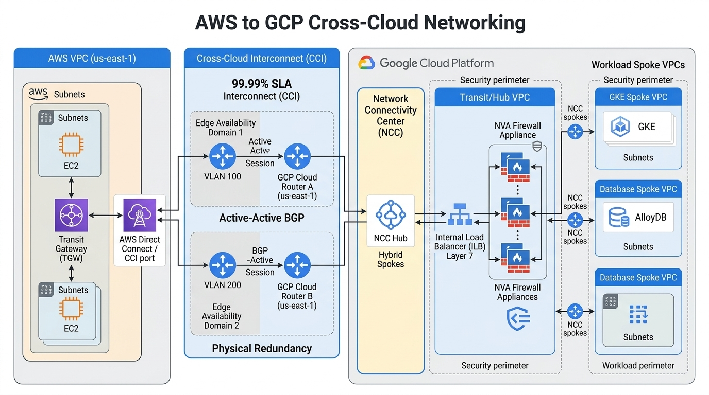
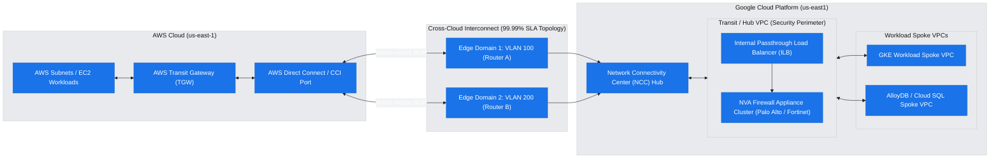
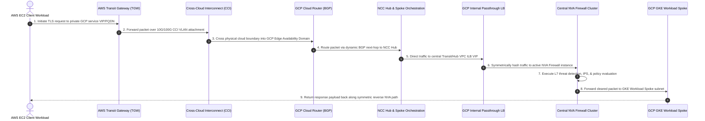

# Enterprise Multi-Cloud Cross-Cloud Networking Architecture

**Author:** Practice CE / Cloud Architect  
**Date:** 2026-07-21  
**Status:** Final  
**Target Audience:** Cloud Architect / Enterprise Operator  

---

## 1. Executive Summary & Problem Framing

As enterprise organizations adopt multi-cloud strategies across Amazon Web Services (AWS) and Google Cloud Platform (GCP), establishing secure, high-throughput, and SLA-backed cross-cloud network interconnectivity is critical. Transmitting mission-critical application traffic between clouds without routing through the public internet requires dedicated physical infrastructure, dynamic BGP routing, and centralized Layer 7 security inspection.

This architectural research report presents a production-grade **Cross-Cloud Networking Architecture** connecting AWS VPCs to GCP VPCs. The solution leverages **Google Cloud Cross-Cloud Interconnect (CCI)** to establish direct, SLA-protected physical transport (10 Gbps – 100 Gbps), **Network Connectivity Center (NCC)** as the enterprise hub-and-spoke orchestration framework, and a central **Transit/Hub VPC hosting Network Virtual Appliance (NVA) firewalls** for deep packet inspection of all inter-cloud traffic.

### WAF Discovery & Customer Priorities (`agent-waf-system` Outcomes)

Before selecting the hybrid interconnect topology, the following trade-off priorities were established via WAF discovery using the native `agent-waf-system` skill:

- **Target Cloud Environments**: Amazon Web Services (AWS) & Google Cloud Platform (GCP).
- **Bandwidth & Throughput**: High Bandwidth (10 Gbps – 100 Gbps SLA-backed direct transport via Cross-Cloud Interconnect).
- **Latency Sensitivity & Availability SLA**: Mission-Critical **99.99% Availability SLA** utilizing dual-edge availability domain physical redundancy with active-active dynamic BGP routing.
- **Security Perimeter & Inspection Model**: **Hub-and-Spoke via Network Connectivity Center (NCC) with Central NVA Firewall Inspection** (all cross-cloud east-west and north-south flows routed through centralized Layer 7 NVA appliances behind an Internal Load Balancer).

> [!IMPORTANT]
> **Pre-GA / Preview Feature Alert**  
> All core architectural components proposed in this document—including **Dedicated Cross-Cloud Interconnect (CCI)**, **99.99% SLA Critical Production Topology**, **Network Connectivity Center (NCC) Hub & Spokes**, and **Router Appliance NVA Integration**—are **Generally Available (GA)**.  
> *Note on Partner Automation:* If adopting *Partner Cross-Cloud Interconnect for AWS with automated NCC provisioning*, that specific partner orchestration feature is currently in **Preview**. Standard Dedicated Cross-Cloud Interconnect is fully GA.

---

## 2. Technical Architecture & Topology

The multi-cloud network topology bridges AWS `us-east-1` and GCP `us-east1` through high-speed Cross-Cloud Interconnect links. Google provisions physical fiber directly into AWS Direct Connect locations, eliminating third-party colocation facilities and manual circuit ordering.

### Architectural Blueprint Components

1. **Cross-Cloud Interconnect (CCI) Physical Layer**:
   - Two distinct 10 Gbps / 100 Gbps Cross-Cloud Interconnect connections terminated in separate **Edge Availability Domains** (Edge Domain 1 & Edge Domain 2) in the metropolitan area.
   - Dual GCP Cloud Routers (`Cloud Router A` and `Cloud Router B`) handling multi-hop BGP sessions over dynamic VLAN attachments with active-active ECMP pathing.
2. **Network Connectivity Center (NCC) Orchestration**:
   - An **NCC Hub** centralizes routing logic across Google Cloud.
   - **Hybrid Spokes** connect the Cross-Cloud Interconnect VLAN attachments to the NCC Hub.
   - **VPC Spokes** connect the central Transit/Hub VPC and workload VPCs to the NCC Hub.
3. **Central Transit / Hub VPC with NVA Inspection**:
   - Hosts a cluster of high-availability **Network Virtual Appliances (NVAs)** (e.g., Palo Alto VM-Series, Fortinet FortiGate, or Check Point CloudGuard) deployed across multiple zones.
   - An **Internal Passthrough Network Load Balancer (ILB)** front-ends the NVA cluster for symmetric health-checked traffic distribution.
   - **Router Appliance VMs** peer with GCP Cloud Routers via BGP to steer cross-cloud traffic through the NVA inspection boundary.
4. **Workload Spoke VPCs**:
   - Dedicated GKE cluster VPCs and database VPCs (AlloyDB / Cloud SQL) attached as NCC VPC spokes, fully isolated from direct AWS routing.

### High-Fidelity Architecture Diagram

_Note: Rendered via `creating-gcp-diagrams` and stored in `assets/architecture_diagram.png`._

#### Architectural Topology Draft (Mermaid)

---

## 3. Communication Sequence & Traffic Flows

Cross-cloud traffic between an AWS EC2 application client and a GCP GKE microservice follows a multi-stage request and response path enforced by BGP route learning, private DNS forwarding, and NVA Layer 7 firewall inspection.

### Communication Sequence Chart

> [!NOTE]
> **Asset Storage Location**: Visual assets and rendered diagrams are located in `references/enterprise_multicloud/assets/`.

---

## 4. Well-Architected Framework (WAF) Alignment & Verification

This architecture is verified against the five pillars of the Google Cloud Well-Architected Framework (WAF), directly addressing the priorities established during discovery:

| WAF Pillar | Architectural Design Decision & Technical Mitigation | Verification Evidence & Citation Link |
| :--- | :--- | :--- |
| **Operational Excellence** | Infrastructure as Code (Terraform) provisioning of NCC hubs, Cloud Routers, and VLAN attachments. Centralized Cloud Audit Logs and VPC Flow Logs enabled across all hub and spoke VPCs. | [Cloud Interconnect Overview](https://docs.cloud.google.com/network-connectivity/docs/interconnect/concepts/overview) |
| **Security, Privacy & Compliance** | Zero internet exposure for cross-cloud traffic. Centralized Layer 7 NVA firewall inspection for all east-west AWS-to-GCP flows. Enforces microsegmentation using GCP Firewall Policies and VPC Service Controls. | [CCN NVA Reference Architecture](https://docs.cloud.google.com/architecture/ccn-distributed-apps-design/ccn-nva-ra) |
| **Reliability** | **99.99% Availability SLA** using dual Edge Availability Domains with active-active ECMP BGP routing. Router Appliance VMs in multi-zone configuration prevent single NVA node failure. | [Establishing 99.99% SLA Interconnect](https://docs.cloud.google.com/network-connectivity/docs/interconnect/tutorials/dedicated-creating-9999-availability) |
| **Cost Optimization** | Eliminates third-party colocation facilities and expensive cross-connect cabling fees. Direct Cross-Cloud Interconnect egress rates provide lower per-GB pricing compared to public internet egress. | [Cross-Cloud Interconnect Overview](https://docs.cloud.google.com/network-connectivity/docs/interconnect/concepts/cci-overview) |
| **Performance Efficiency** | Sub-10ms latency over dedicated 10 Gbps / 100 Gbps physical links. High-throughput packet forwarding via GCP Internal Load Balancer and multi-queue NVA instances. | [Network Connectivity Center Overview](https://docs.cloud.google.com/network-connectivity/docs/network-connectivity-center/concepts/overview) |

---

## 5. Citations & Validated Documentation Links

Every claim, SLA metric, and architectural pattern in this report is grounded in official Google Cloud documentation and verified engineering guidelines:

1. **[Cross-Cloud Interconnect Overview](https://docs.cloud.google.com/network-connectivity/docs/interconnect/concepts/cci-overview)** - Authoritative guidance for provisioning dedicated physical links between Google Cloud and AWS.
2. **[Establish 99.99% Availability for Cloud Interconnect](https://docs.cloud.google.com/network-connectivity/docs/interconnect/tutorials/dedicated-creating-9999-availability)** - Multi-region and dual edge availability domain requirements for production-critical 99.99% SLAs.
3. **[Network Connectivity Center (NCC) Overview](https://docs.cloud.google.com/network-connectivity/docs/network-connectivity-center/concepts/overview)** - Architecture for hub-and-spoke orchestration across hybrid and VPC spokes.
4. **[VPC Cross-Cloud Network with NVAs Architecture](https://docs.cloud.google.com/architecture/ccn-distributed-apps-design/ccn-nva-ra)** - Google Cloud Architecture Center guide for NVA firewall insertion in hub-and-spoke topologies.
5. **[Partner Cross-Cloud Interconnect for AWS Overview](https://docs.cloud.google.com/network-connectivity/docs/interconnect/concepts/partner-cci-for-aws-overview)** - Overview of automated partner provisioning for AWS-to-GCP connectivity.
6. **[Google Cloud Well-Architected Framework](https://docs.cloud.google.com/architecture/framework)** - Core enterprise architecture and governance standards.

---

_Generated by Antigravity CE Solution Researcher_
