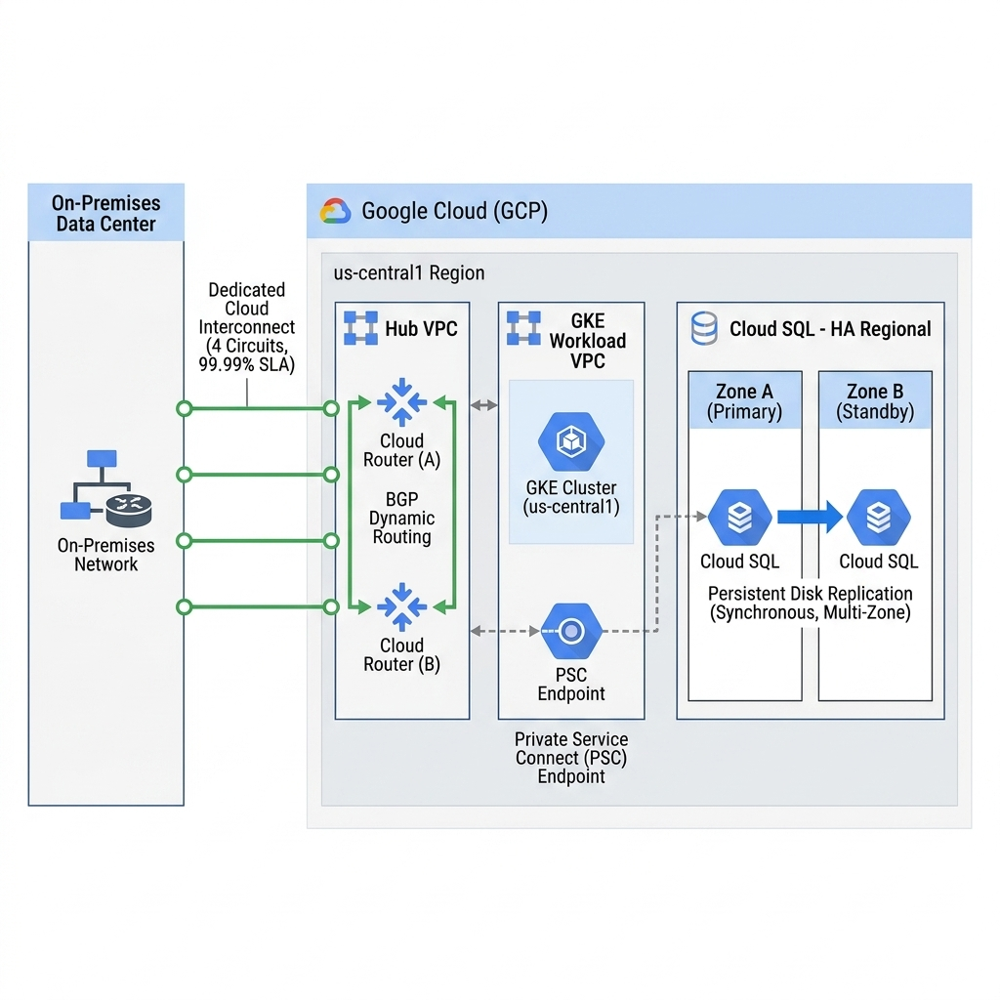
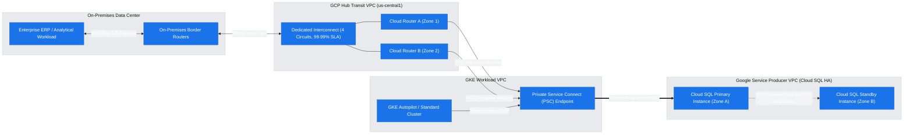
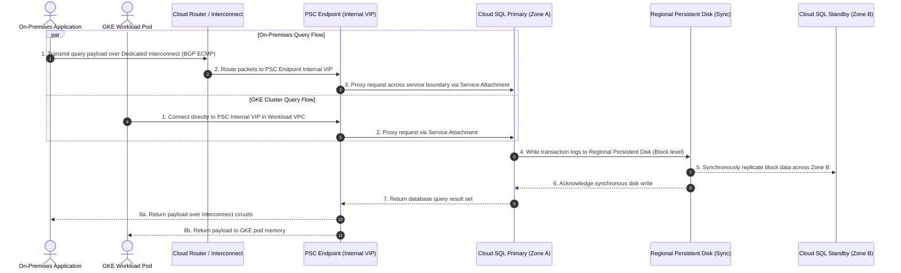

# Customer Engineering Architecture Research Report: HA Cloud SQL with Hybrid & GKE Access

**Author:** Practice CE / Cloud Architect  
**Date:** 2026-07-09  
**Status:** Final  
**Target Audience:** Cloud Architect / Enterprise Operator

---

## 1. Executive Summary & Problem Framing

An enterprise customer is deploying a mission-critical **Google Cloud SQL database architecture** requiring sub-10ms high-throughput access from on-premises data centers and internal Google Kubernetes Engine (GKE) workloads. The core architectural objectives are 99.99% High Availability (HA) across regional zones, zero IP-overlap private networking, and enterprise-grade fault redundancy without exposing database endpoints to public internet routing.

### WAF Discovery & Customer Priorities (`agent-waf-system` Outcomes)

Before selecting the networking and replication topology, the following trade-off priorities were established via WAF discovery:

- **Bandwidth & Throughput**: `Heavy Enterprise Throughput (10 Gbps to 100 Gbps+)` -> _Selected Dedicated Cloud Interconnect (4 circuits across dual facilities) to support high-speed database replication and transactional sync._
- **Latency Sensitivity & SLA**: `Regional High Availability (99.99% SLA) across dual zones` -> _Selected Cloud SQL Regional HA using synchronous regional persistent disk block replication across two independent zones in us-central1._
- **Security Perimeter & Isolation**: `Private Service Connect (PSC) Endpoint` -> _Selected zero IP-overlap consumer-producer service abstraction over VPC peering to decouple database networking from workload VPCs._
- **Cost vs. Redundancy**: `Maximize Redundancy (Active-Active multi-path routing)` -> _Selected dynamic global BGP routing with redundant Cloud Routers across Interconnect edge availability domains._

> [!IMPORTANT]
> **Pre-GA / Preview Feature Alert**  
> All infrastructure and database components proposed in this architecture—including **Cloud SQL Regional HA**, **Private Service Connect (PSC) Endpoints for Cloud SQL**, **Dedicated Cloud Interconnect**, and **Cloud Router BGP Dynamic Routing**—are **Generally Available (GA)** and fully supported for enterprise production workloads.

---

## 2. Technical Architecture & Topology

The architecture separates hybrid transit networking from database production workloads using a Hub-and-Spoke VPC topology combined with Private Service Connect (PSC) service endpoints.

### High-Fidelity Architecture Diagram

_Note: Rendered into a flat 2D vector PNG via `creating-gcp-diagrams` and saved in `assets/architecture_diagram.jpg`._

#### Architectural Topology Draft (Mermaid)

---

## 3. Communication Sequence & Traffic Flows

When an on-premises enterprise application or internal GKE microservice initiates a transactional SQL query against the database, traffic traverses a fully private, encrypted hardware and SDN data plane.

### Communication Sequence Chart

---

## 4. Well-Architected Framework (WAF) Alignment & Verification

This architecture has been audited against the 5 pillars of the Google Cloud Well-Architected Framework (WAF) using `agent-waf-system`, directly addressing the customer's stated trade-off priorities:

| WAF Pillar                         | Architectural Design Decision & Mitigation                                                                                                                                                                                                                                    | Verification Evidence / Reference                                                                                                                             |
| :--------------------------------- | :---------------------------------------------------------------------------------------------------------------------------------------------------------------------------------------------------------------------------------------------------------------------------- | :------------------------------------------------------------------------------------------------------------------------------------------------------------ |
| **Reliability**                    | Cloud SQL configured with regional availability type using synchronous regional persistent disk replication across dual zones, ensuring RPO=0 and SLA 99.99%. Dedicated Interconnect deployed across 4 circuits in 2 metro edge availability domains with dual Cloud Routers. | [Cloud SQL HA Overview](https://docs.cloud.google.com/sql/docs/postgres/configure-ha)                                                                         |
| **Security, Privacy & Compliance** | Database networking decoupled from consumer VPCs using Private Service Connect (PSC) endpoints. Prevents RFC 1918 IP overlap and restricts lateral network movement by enforcing unidirectional consumer-to-producer service access.                                          | [PSC for Cloud SQL](https://docs.cloud.google.com/sql/docs/mysql/about-private-service-connect)                                                               |
| **Performance Efficiency**         | Dedicated Cloud Interconnect circuits (100 Gbps LR Ethernet) provide guaranteed sub-millisecond physical transport from on-premises data centers, while local GKE pods access Cloud SQL over in-region PSC internal VIPs with zero proxy bottlenecks.                         | [Dedicated Interconnect 99.99% Topology](https://docs.cloud.google.com/network-connectivity/docs/interconnect/tutorials/dedicated-creating-9999-availability) |
| **Operational Excellence**         | Automated failover managed transparently by Google Cloud health checks without IP address changes (PSC VIP remains static during primary-standby failover). BGP dynamic routing automates route convergence across cloud boundaries.                                          | [PSC Service Connections](https://docs.cloud.google.com/sql/docs/mysql/configure-private-services-access-and-private-service-connect)                         |
| **Cost Optimization**              | Consolidated PSC endpoints allow multiple GKE namespaces and on-prem routers to access database services without provisioning redundant NAT gateways or paying VPC peering data egress cross-zone penalties.                                                                  | [Cloud SQL Connection Options](https://docs.cloud.google.com/sql/docs/mysql/about-private-service-connect)                                                    |

---

## 5. Citations & Validated Documentation Links

Every architectural recommendation is sourced directly from authoritative Google Cloud engineering documentation via MCP:

1. **[Cloud SQL High Availability Configuration](https://docs.cloud.google.com/sql/docs/postgres/configure-ha)** - Official guide for regional HA instances and synchronous persistent disk replication.
2. **[Private Service Connect for Cloud SQL](https://docs.cloud.google.com/sql/docs/mysql/about-private-service-connect)** - Grounding for private endpoint service attachments and multi-VPC database access.
3. **[Dedicated Interconnect 99.99% Availability Topology](https://docs.cloud.google.com/network-connectivity/docs/interconnect/tutorials/dedicated-creating-9999-availability)** - Architecture requirements for redundant 4-circuit hybrid connectivity.
4. **[Cloud SQL Private Services Access and PSC Setup](https://docs.cloud.google.com/sql/docs/mysql/configure-private-services-access-and-private-service-connect)** - Implementation instructions for configuring service connection policies and endpoint propagation.

---

_Generated by Antigravity CE Solution Researcher_
