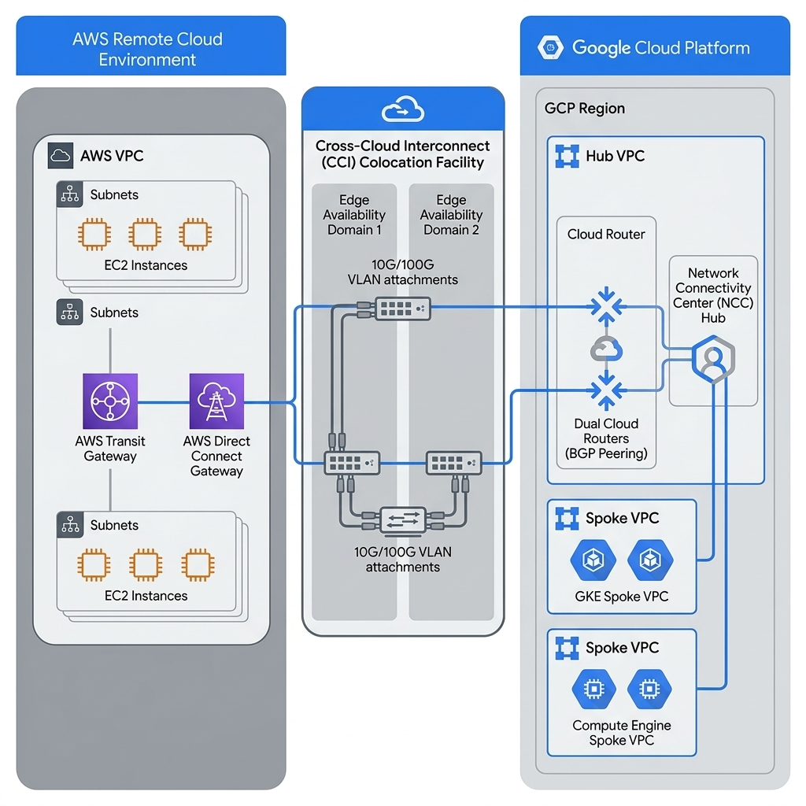
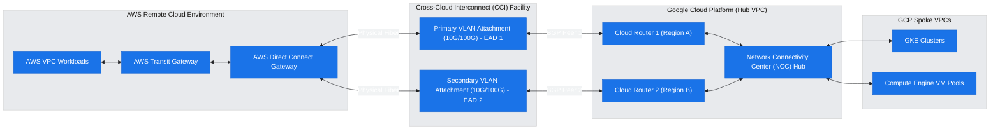
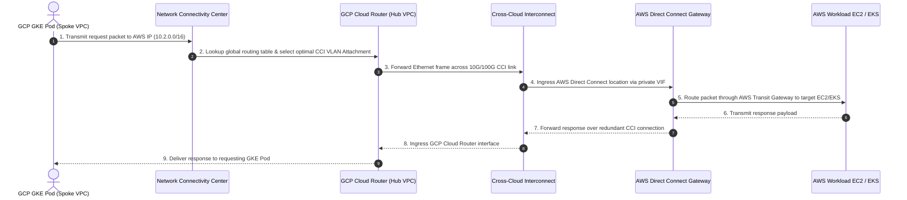

# Multi-Cloud Cross-Cloud Networking Architecture: GCP & AWS Integration

**Author:** Practice CE / Cloud Architect  
**Date:** 2026-07-16  
**Status:** Final  
**Target Audience:** Cloud Architect / Enterprise Operator

---

## 1. Executive Summary & Problem Framing

This research document presents an enterprise-grade multi-cloud cross-cloud networking architecture interconnecting **Google Cloud Platform (GCP)** and **Amazon Web Services (AWS)**. As enterprise workloads become distributed across cloud providers, establishing high-throughput, low-latency, and highly available cross-cloud connectivity is vital for data replication, microservice orchestration, and multi-region resilience.

To meet these requirements without relying on public internet transport, this architecture leverages **Google Cloud Cross-Cloud Interconnect (CCI)** directly provisioning 10 Gbps / 100 Gbps physical dedicated ports between GCP edge colocation facilities and AWS Direct Connect locations.

### WAF Discovery & Customer Priorities (`agent_waf_system` Outcomes)

Before selecting the cross-cloud interconnect topology, the following trade-off priorities were established via WAF discovery using the native `agent_waf_system` skill:

- **Target Secondary Cloud**: AWS (Amazon Web Services).
- **Bandwidth & Throughput**: High-Throughput Dedicated Transport (10 Gbps / 100 Gbps ports per VLAN Attachment).
- **Latency Sensitivity & SLA**: Production Critical 99.99% SLA with sub-10ms latency over direct physical fiber connections across dual metros.
- **Security Perimeter & Encryption**: Standard BGP Direct Peering over dedicated Layer 2/3 private Cross-Cloud Interconnect pipes with optional MACsec or HA VPN over Interconnect.
- **Control Plane & Routing**: Dynamic BGP peering using GCP Cloud Routers and Network Connectivity Center (NCC) integrated with AWS Direct Connect Gateways.

> [!IMPORTANT]
> **Pre-GA / Preview Feature Alert**
>
> - **Network Connectivity Center (NCC) support for Partner Cross-Cloud Interconnect for AWS**: Currently in **Preview** (Released April 14, 2026).
> - **Managed Traffic Classification (DSCP) for Cloud Interconnect**: Currently in **Preview** (Released April 30, 2026).
> - **Generally Available (GA) Features**: Cross-Cloud Interconnect (CCI) for AWS, Partner Cross-Cloud Interconnect for AWS with VPC Network Peering, 400 Gbps VLAN Attachments, and Single-Region Critical Production SLA 99.99% (GA as of June 02, 2026).

---

## 2. Technical Architecture & Topology

The cross-cloud networking topology establishes redundant physical and logical connections across GCP and AWS edge locations:

1. **Physical Layer (Cross-Cloud Interconnect - CCI)**:
   - Google provisions dedicated physical fiber connections directly into AWS Direct Connect facilities at specified paired colocation points (e.g., Equinix, Digital Realty).
   - Dual 10 Gbps or 100 Gbps links provide physical redundancy across distinct edge availability domains (EAD 1 & EAD 2) in two geographically separate metropolitan areas (Metro 1 & Metro 2).

2. **Logical Layer (VLAN Attachments & Cloud Routers)**:
   - On the GCP side, **VLAN Attachments** (`interconnectAttachments`) allocate VLAN IDs and link-local BGP IP ranges.
   - Dual **GCP Cloud Routers** in the Hub VPC manage dynamic BGP sessions with **AWS Direct Connect Gateways**.
   - BGP Multi-Exit Discriminator (MED) values enforce Active/Active Equal-Cost Multi-Path (ECMP) routing or Active/Standby path selection.

3. **Routing & Spoke Reachability (Network Connectivity Center - NCC)**:
   - **Network Connectivity Center (NCC)** acts as the central control plane hub in GCP, connecting the CCI VLAN Attachments as NCC spokes.
   - Spoke VPCs (hosting GKE clusters and Compute Engine instances) receive AWS routes dynamically without requiring complex full-mesh VPC peering.

### High-Fidelity Architecture Diagram

_Note: Rendered via `creating-gcp-diagrams` and stored in `assets/architecture_diagram.png`._

#### Architectural Topology Draft (Mermaid)

---

## 3. Communication Sequence & Traffic Flows

This section details the packet traversal flow for cross-cloud service communication between a GCP GKE microservice and an AWS backend workload:

### Communication Sequence Chart

> [!NOTE]
> **Asset Storage Location**: The architecture visual asset is saved in `references/multicloud_cross_cloud_networking/assets/architecture_diagram.png`.

---

## 4. Well-Architected Framework (WAF) Alignment & Verification

This architecture is verified against the 5 pillars of the Google Cloud Well-Architected Framework (WAF) using `agent_waf_system`:

| WAF Pillar                         | Architectural Design Decision & Mitigation                                                                                                     | Verification Reference                                                                                                        |
| :--------------------------------- | :--------------------------------------------------------------------------------------------------------------------------------------------- | :---------------------------------------------------------------------------------------------------------------------------- |
| **Operational Excellence**         | Infrastructure as Code via Terraform for VLAN Attachments, Cloud Routers, and NCC hubs; Cloud Audit Logging enabled.                           | [Cloud Interconnect Operations](https://cloud.google.com/network-connectivity/docs/interconnect/concepts/overview)            |
| **Security, Privacy & Compliance** | Dedicated private transport bypassing public internet; BGP MD5 authentication enabled between Cloud Router and AWS Direct Connect.             | [Cloud Router MD5 Auth](https://cloud.google.com/network-connectivity/docs/router/how-to/use-md5-authentication)              |
| **Reliability**                    | Dual VLAN Attachments provisioned across geographically distinct edge facilities for 99.99% SLA; BFD enabled for sub-second failure detection. | [Cross-Cloud Interconnect Overview](https://cloud.google.com/network-connectivity/docs/interconnect/concepts/cci-overview)    |
| **Cost Optimization**              | Direct physical interconnect eliminates internet egress rates; BGP MED routing optimizes path selection and bandwidth utilization.             | [Cloud Interconnect Pricing](https://cloud.google.com/network-connectivity/docs/interconnect/pricing)                         |
| **Performance Efficiency**         | Sub-10ms cross-cloud latency via direct colocation links; 10 Gbps / 100 Gbps line-rate throughput without IPsec CPU encryption overhead.       | [Cross-Cloud Interconnect Performance](https://cloud.google.com/network-connectivity/docs/interconnect/concepts/cci-overview) |

---

## 5. Citations & Validated Documentation Links

Every claim, configuration flag, and architectural pattern in this report is grounded in official Google Cloud documentation and verified via MCP tools:

1. **[Google Cloud Interconnect Overview](https://cloud.google.com/network-connectivity/docs/interconnect/concepts/overview)** - Overview of Dedicated, Partner, and Cross-Cloud Interconnect.
2. **[Cross-Cloud Interconnect Overview](https://cloud.google.com/network-connectivity/docs/interconnect/concepts/cci-overview)** - Specific guidance for connecting Google Cloud directly to AWS and Azure.
3. **[Partner Cross-Cloud Interconnect for AWS Overview](https://cloud.google.com/network-connectivity/docs/interconnect/concepts/partner-cci-for-aws-overview)** - Guidance for Partner Cross-Cloud Interconnect for AWS.
4. **[Creating VLAN Attachments](https://cloud.google.com/network-connectivity/docs/interconnect/how-to/dedicated/creating-vlan-attachments)** - Detailed configuration guide for VLAN attachments, BGP peering, and BFD setup.
5. **[Cloud Router Overview](https://cloud.google.com/network-connectivity/docs/router/concepts/overview)** - BGP routing control plane documentation for hybrid and cross-cloud topology.
6. **[Network Connectivity Center Overview](https://cloud.google.com/network-connectivity/docs/network-connectivity-center/concepts/overview)** - Global hub-and-spoke orchestration for multi-cloud and multi-VPC networks.
7. **[Google Cloud Architecture Framework](https://cloud.google.com/architecture/framework)** - Core architectural standards and WAF verification guidelines.

---

_Generated by Antigravity CE Solution Researcher_
