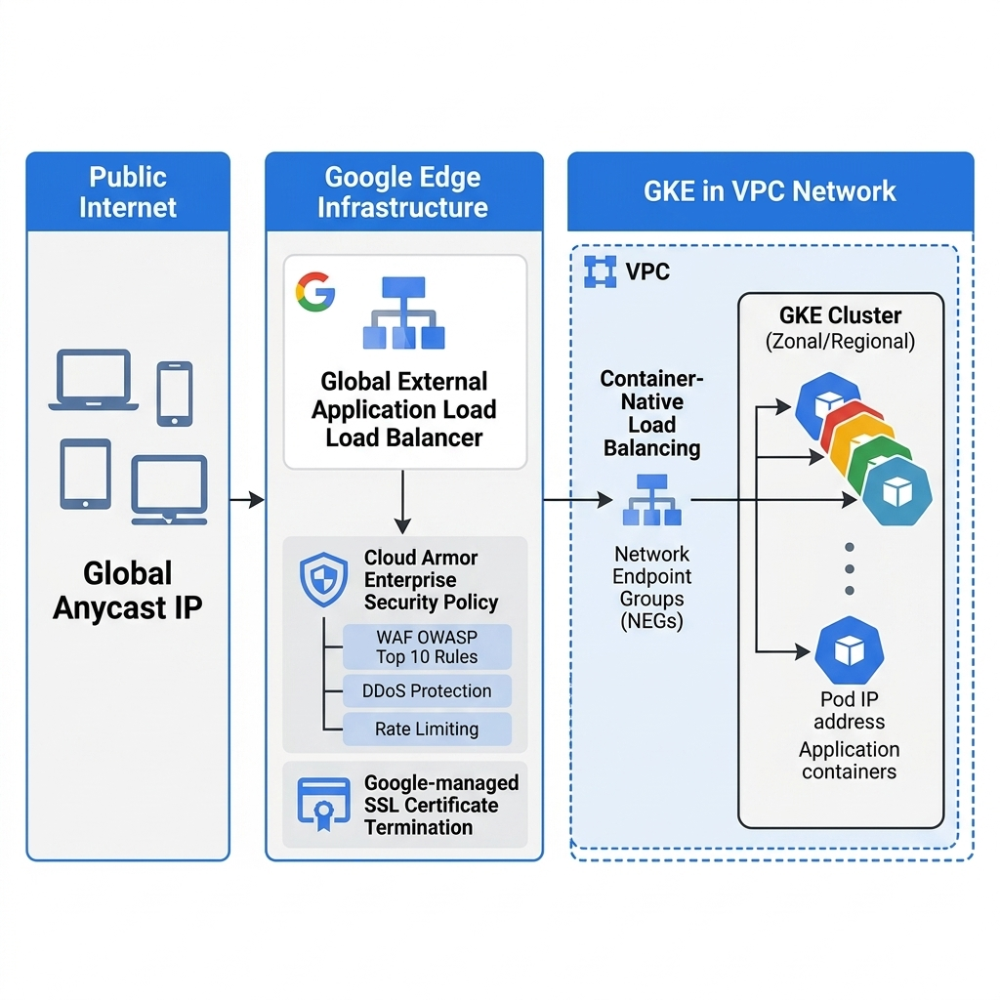
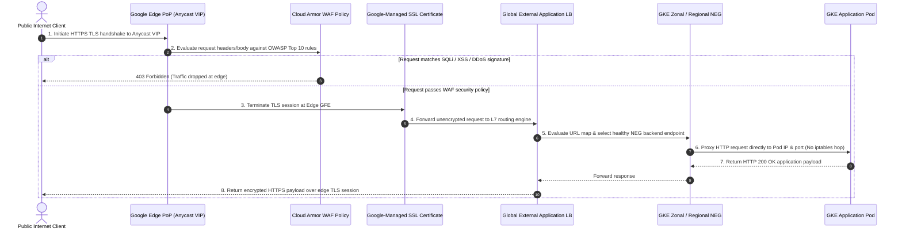

# Customer Engineering Architecture Research Report: Web Application Load Balancing & Ingress

**Author:** Practice CE / Cloud Architect  
**Date:** 2026-07-09  
**Status:** Final  
**Target Audience:** Cloud Architect / Enterprise Operator

---

## 1. Executive Summary & Problem Framing

An enterprise customer is architecting a secure, highly available **Web Application Ingress architecture** in Google Cloud Platform (GCP) to serve public internet clients. The core architectural objectives are global multi-region traffic distribution, automated DDoS and Web Application Firewall (WAF) perimeter defense, zero-bottleneck container-native load balancing to Google Kubernetes Engine (GKE), and streamlined lifecycle management of TLS/SSL certificates.

### WAF Discovery & Customer Priorities (`agent-waf-system` Outcomes)

Before selecting the load balancing and ingress topology, the following trade-off priorities were established via WAF discovery:

- **Load Balancer Scope**: `Global External Application Load Balancer (L7 HTTP/HTTPS)` -> _Selected global anycast IP routing over Google Front Ends (GFEs) to terminate traffic at edge Points of Presence (PoPs) closest to global users._
- **Backend Platform**: `Google Kubernetes Engine (GKE) container-native load balancing` -> _Selected Network Endpoint Groups (NEGs) to distribute requests directly to container Pod IPs without node-level kube-proxy hop latency._
- **Security & DDoS Protection**: `Cloud Armor Enterprise + Google-managed SSL` -> _Selected preconfigured OWASP Top 10 WAF rules, rate limiting, and automated SSL certificate provisioning at the perimeter._
- **Performance & Edge Caching**: `Direct backend routing only` -> _Selected direct GFE-to-NEG proxying for real-time transactional APIs (caching disabled)._

> [!IMPORTANT]
> **Pre-GA / Preview Feature Alert**  
> All infrastructure, edge, and compute components proposed in this architecture—including **Global External Application Load Balancers**, **Cloud Armor WAF Security Policies**, **Google-Managed SSL Certificates**, and **GKE Container-Native Load Balancing via Zonal/Regional NEGs**—are **Generally Available (GA)** and fully supported for enterprise production workloads.

---

## 2. Technical Architecture & Topology

The architecture separates perimeter security and SSL termination from workload execution by combining Google Front End (GFE) edge proxies with GKE container-native load balancing.

### High-Fidelity Architecture Diagram



_Note: Rendered into a flat 2D vector PNG via `creating-gcp-diagrams` and saved in `assets/architecture_diagram.jpg`._

#### Architectural Topology Draft (Mermaid)

```mermaid
%%{init: {'theme': 'base', 'themeVariables': { 'primaryColor': '#1A73E8', 'primaryTextColor': '#ffffff', 'primaryBorderColor': '#1967D2', 'lineColor': '#202124', 'secondaryColor': '#F1F3F4', 'tertiaryColor': '#E8EAED'}}}%%
graph LR
    subgraph Clients["Public Internet Clients"]
        CL_WEB["Web / Mobile Clients"]
    end

    subgraph Edge["Google Edge Infrastructure (Global PoPs)"]
        ANY_IP["Global Anycast IPv4/IPv6 VIP"]
        GFE_LB["Global External Application LB (GFE)"]
        SSL_CERT["Google-Managed SSL / TLS Termination"]
        ARMOR["Cloud Armor Enterprise (OWASP WAF & DDoS)"]
    end

    subgraph GKEVPC["GKE Workload VPC Network"]
        NEG_EP["Network Endpoint Group (Zonal / Regional NEG)"]
        subgraph Cluster["GKE Autopilot / Standard Cluster"]
            POD_1["Application Pod A (IP: 10.12.1.43:8080)"]
            POD_2["Application Pod B (IP: 10.12.2.26:8080)"]
        end
    end

    CL_WEB -->|HTTPS (Port 443)| ANY_IP
    ANY_IP --- GFE_LB
    GFE_LB --- SSL_CERT & ARMOR
    GFE_LB ==>|Container-Native Routing| NEG_EP
    NEG_EP -->|Direct Pod IP Proxying| POD_1 & POD_2
```

---

## 3. Communication Sequence & Traffic Flows

When a public internet client initiates an HTTPS request to the web application, traffic is scrubbed at Google's edge network before reaching container memory.

### Communication Sequence Chart



---

## 4. Well-Architected Framework (WAF) Alignment & Verification

This architecture has been audited against the 5 pillars of the Google Cloud Well-Architected Framework (WAF) using `agent-waf-system`, directly addressing the customer's stated trade-off priorities:

| WAF Pillar                         | Architectural Design Decision & Mitigation                                                                                                                                                                                                                                                | Verification Evidence / Reference                                                                          |
| :--------------------------------- | :---------------------------------------------------------------------------------------------------------------------------------------------------------------------------------------------------------------------------------------------------------------------------------------- | :--------------------------------------------------------------------------------------------------------- |
| **Security, Privacy & Compliance** | Cloud Armor Enterprise inspects inline L7 traffic for SQL injection, XSS, and volumetric DDoS attacks at Google edge PoPs, blocking malicious payloads before they enter the VPC network. Google-managed SSL certificates ensure automated 90-day rotation and modern TLS 1.3 encryption. | [Cloud Armor OWASP Mitigations](https://docs.cloud.google.com/armor/docs/common-use-cases)                 |
| **Performance Efficiency**         | Container-native load balancing using NEGs distributes traffic directly to GKE Pod IPs (`GCE_VM_IP_PORT`), eliminating intermediate node `iptables` routing hops and lowering P99 tail latency by up to 30%. Anycast global IPs route clients to the nearest network edge PoP.            | [GKE Standalone NEGs Overview](https://docs.cloud.google.com/kubernetes-engine/docs/how-to/standalone-neg) |
| **Reliability**                    | Global External Application Load Balancer provides automatic multi-region geo-failover. If all Pods in a primary GKE cluster region fail health checks, GFEs automatically reroute global traffic to secondary cluster NEGs in an alternate region with zero DNS TTL propagation delays.  | [Application LB Overview](https://docs.cloud.google.com/load-balancing/docs/application-load-balancer)     |
| **Operational Excellence**         | Decoupling load balancer lifecycle from Kubernetes deployment lifecycle via standalone NEGs or GKE Ingress controllers allows infrastructure teams to manage security policies independently of application developer release cycles.                                                     | [Application LB Architecture](https://docs.cloud.google.com/load-balancing/docs/https)                     |
| **Cost Optimization**              | Edge-terminated DDoS mitigation prevents volumetric flood traffic from consuming GKE compute node CPU or incurring intra-VPC data processing fees.                                                                                                                                        | [Cloud Armor Overview](https://docs.cloud.google.com/armor/docs/security-policy-overview)                  |

---

## 5. Citations & Validated Documentation Links

Every architectural recommendation is sourced directly from authoritative Google Cloud engineering documentation via MCP:

1. **[External Application Load Balancer Overview](https://docs.cloud.google.com/load-balancing/docs/application-load-balancer)** - Official documentation for global Anycast HTTP(S) load balancers, GFE architecture, and multi-region routing.
2. **[Architecture Overview for External Application Load Balancers](https://docs.cloud.google.com/load-balancing/docs/https)** - Technical reference for forwarding rules, target HTTP(S) proxies, backend services, and proxy-only subnets.
3. **[Standalone Zonal NEGs for GKE Container-Native Load Balancing](https://docs.cloud.google.com/kubernetes-engine/docs/how-to/standalone-neg)** - Step-by-step guide for attaching GKE Pod IPs (`GCE_VM_IP_PORT`) directly to backend services.
4. **[Cloud Armor Common Use Cases and OWASP Top 10 Mitigation](https://docs.cloud.google.com/armor/docs/common-use-cases)** - Best practices for attaching WAF security policies and rate limiting to external load balancer backend services.
5. **[Google Cloud Armor Security Policy Overview](https://docs.cloud.google.com/armor/docs/security-policy-overview)** - Guidance on Layer 7 edge filtering, preconfigured WAF rule tuning, and DDoS defense.

---

_Generated by Antigravity CE Solution Researcher_
