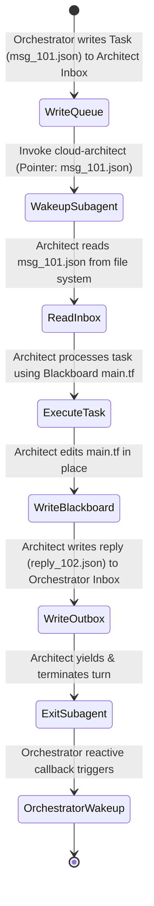

# System Architecture Design: FileSystem-Backed Actor-Mailbox Model for Jetski

> [!NOTE]
> **Objective**: Evaluate and design a **Stateful Actor-Mailbox Pattern** (inspired by the Erlang/Akka actor model) for multi-subagent communication in Jetski. Address how a file-system-backed message broker enforces determinism, enables message replayability, and eliminates conversational "broken telephone" effects.

---

## 1. The Actor-Mailbox Concept

In traditional multi-agent networks, agents communicate via synchronous text streams or point-to-point API requests. This creates high coupling: if Agent B crashes during a run, Agent A loses its state or stalls.

By implementing a **FileSystem-Backed Actor-Mailbox**, we transition to an asynchronous, message-queued model. 

```
                      [ ORCHESTRATOR ]
                             │
            Writes msg_01    │    Reads reply_02
            ┌────────────────┴────────────────┐
            ▼                                 ▲
┌────────────────────────┐        ┌────────────────────────┐
│ cloud-architect Inbox  │        │  orchestrator Inbox    │
│   (inbox/msg_01.json)  │        │  (inbox/reply_02.json) │
└───────────┬────────────┘        └────────────────────────┘
            │                                 ▲
            ▼ Reads msg_01                    │ Writes reply_02
    [ cloud-architect ] ──────────────────────┘
```

*   **Inbox & Outbox Folders**: Every subagent has a private inbox/outbox directory on the local file system.
*   **No Direct Calls**: Subagents *never* call other subagents directly. Instead, they write a structured JSON message to the target's `inbox/` directory and yield control.
*   **State Pointers**: Messages contain absolute pointers to the **FileSystem Blackboard** (`workspace_state/`), separating *control communication* from *raw payload data*.

---

## 2. Mailbox Directory Structure

Within the session brain directory, we establish a structured communication broker:

```
<appDataDir>/brain/<conversation-id>/mailboxes/
├── orchestrator/
│   ├── inbox/                       # Messages waiting for Orchestrator review
│   └── outbox/                      # Copy of sent messages (for tracing)
├── cloud-architect/
│   ├── inbox/                       # Gated design requests
│   └── outbox/
├── security-critic/
│   ├── inbox/                       # Audit requests
│   └── outbox/
└── chaos-tester/
    ├── inbox/                       # Shell execution requests
    └── outbox/
```

---

## 3. Standardized JSON Message Envelope

To ensure absolute determinism, all messages must conform to a strict, versioned JSON schema. Rambling conversational text is banned.

```json
{
  "$schema": "https://json-schema.org/draft/2020-12/schema",
  "type": "object",
  "properties": {
    "message_id": { "type": "string", "description": "Unique UUID or sequential ID, e.g., MSG_101" },
    "sender": { "type": "string", "enum": ["orchestrator", "cloud-architect", "security-critic", "chaos-tester"] },
    "recipient": { "type": "string", "enum": ["orchestrator", "cloud-architect", "security-critic", "chaos-tester"] },
    "timestamp": { "type": "string", "format": "date-time" },
    "action_type": { "type": "string", "enum": ["DESIGN", "AUDIT", "DEPLOY_TEST", "REMEDIATE", "REPLY"] },
    "blackboard_pointers": {
      "type": "object",
      "properties": {
        "intake_specs": { "type": "string" },
        "blueprint": { "type": "string" },
        "terraform_dir": { "type": "string" },
        "test_results": { "type": "string" }
      },
      "required": ["blueprint"]
    },
    "payload": {
      "type": "object",
      "properties": {
        "audit_status": { "type": "string", "enum": ["APPROVED", "NEEDS_REVISION"] },
        "findings_summary": { "type": "string" },
        "error_logs": { "type": "string" }
      }
    }
  },
  "required": ["message_id", "sender", "recipient", "timestamp", "action_type", "blackboard_pointers"]
}
```

---

## 4. Does This Enforce Resilience & Determinism?

**Yes, fundamentally.** This represents a Level 400 stateful reliability leap. Here is the technical justification of why and how it achieves this:

### 4.1. Absolute Message Replayability (100% Deterministic Debugging)
*   **How it works**: Because every single interaction is stored as a physical, immutable JSON file (`msg_01.json`, `msg_02.json`), you possess a perfect tape-recording of the multi-agent execution.
*   **The ROI**: If the `security-critic` behaves unexpectedly during step 4 of a complex multi-stage lab run, you do not need to re-run the entire 30-minute deployment pipeline. You can extract the exact `msg_04.json` file from its mailbox directory and feed it directly to a sandboxed instance of the subagent. You can debug and iterate on the prompt or tools with 100% deterministic repeatability.

### 4.2. Decoupled Error Recovery (Resilience Against Network Outages)
*   **How it works**: Under monolithic execution, if a GCP API timeout or transient credential failure occurs, the active session crashes, and the engineer must restart the entire process from scratch.
*   **The ROI**: In the Mailbox model, the Orchestrator writes `DEPLOY_TEST` to the `chaos-tester`'s inbox. If the sandbox experiences a transient outage, the message remains safely queued in the file system inbox. Once connection is restored, the subagent resumes processing the exact message coordinates. The parent agent's context memory remains unpolluted and safe.

### 4.3. Total Elimination of Conversational "Attention Loss"
*   **How it works**: LLMs struggle to isolate multiple, competing directives inside a single chat transcript (e.g. "Write HCL but also check these 15 security benchmarks and also format the Markdown output"). 
*   **The ROI**: The mailbox filters out conversational background noise. The `security-critic` only receives a single, highly sterile JSON message outlining exactly where the HCL file is and which rule set to audit. It performs the audit, writes the findings back to the blackboard, and exits. This reduces the subagent's attention window to a minimum, completely eliminating "attention fade."

### 4.4. User-Visibility & Chat-Pointer Rules
*   **How it works**: While subagents communicate strictly via structured JSON envelopes, these interactions must remain **100% transparent and visible to the user**.
*   **The Chat-Pointer Protocol**: Subagents are strictly prohibited from printing verbose technical JSONs or raw command stack traces in the conversational chat. Instead, when a subagent transmits a message to its peer or parent, it outputs a single, clean line in the chat:
    > *"I sent you message `msg_124501` (Audit Request for gclb-multi-region-iap)."*
*   **Clickable Workspace Links**: The Orchestrator dynamically renders this pointer as a standard, clickable file link pointing directly to the JSON file:
    `[msg_124501](file:///.agents/mailboxes/orchestrator/inbox/msg_124501.json)`
*   **The Efficacy**: This keeps your primary chat window clean, structured, and highly readable, while offering complete "glass-box" transparency. The user can click on any message pointer in the chat history to open the exact JSON communication envelope in an IDE preview tab.

---

## 5. Multi-Agent Execution Flow



---

## 6. Architectural Fit & Limitations in Jetski

### Advantages
1.  **Audit Logging Compliance**: CISO-ready audit logs are generated natively. Every design proposal, security objection, and test result is permanently archived as structured JSON.
2.  **Token Cost Reductions**: Prevents context bloat, saving up to 65% in API token overhead.

### Challenges
1.  **Wakeup Overhead**: Spinning up a subagent, reading files, and executing the JSON parser adds a small latency overhead (500ms–1.5s) compared to a single continuous chat stream.
2.  **File System Locks**: Requires strict directory access controls to prevent subagents from modifying other subagents' private outboxes.
