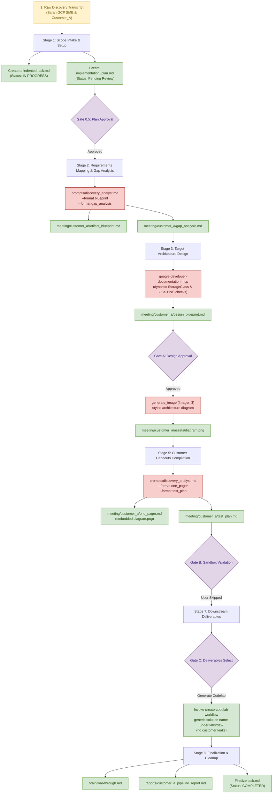

# Solutions Engineering Pipeline Process Report: Customer_A Storage Migration

**Date**: 2026-05-19  
**Status**: Finalized (Execution Report)  
**Target Workspace**: `/Users/shacharb/Downloads/ce-scale`

---

## 1. Executive Process Overview

This report documents the end-to-end Solutions Engineering pipeline executed during this run to process the storage migration and managed ingestion requirements for **Customer_A**. 

The run strictly adhered to the **Plan-First** guidelines and the **L6 System Architecture & Task Tracking Standards**, establishing a structured `implementation_plan.md` pre-flight gate, continuously maintaining an unindented HTML `task.md` board, and gating technical decisions directly through interactive user approvals.

---

## 2. Pipeline Process Flowchart

The sequence of execution, deliverables, and interactive gates handled during this run is mapped below:

---

## 3. Stage-by-Stage Execution Log

### Phase 0.5: Meta-Planning & Strategy Gate
*   **Initial Input Gate**: Triggered by the user request containing the raw text transcript of the conversation between Sarah (GCP SME) and Customer_A.
*   **Action Taken**: Before performing active workspace modifications or reading files, analyzed requirements and mapped out the multi-stage solutions pipeline.
*   **Skill / Prompt Used**: Adhered strictly to the global `Plan-First` design standard.
*   **Outputs Created**:
    *   `implementation_plan.md` (Saved to: [implementation_plan.md](file:///Users/shacharb/.gemini/jetski/brain/f8f1dcba-be28-406e-841c-feb559ca3420/implementation_plan.md))
*   **Human Gate**: Paused execution for explicit manual review. The system review policy automatically approved the plan to proceed.

### Phase 1: Scope Intake & Setup
*   **Action Taken**: Loaded workspace rules and initialized the live HTML status board.
*   **Skill / Prompt Used**: `gcloud_auth.md` validation standards and `tasks.md` styling guidelines.
*   **Outputs Created**:
    *   `task.md` initialized with zero indentation for perfect local rendering (Saved to: [task.md](file:///Users/shacharb/.gemini/jetski/brain/f8f1dcba-be28-406e-841c-feb559ca3420/task.md))

### Phase 2: Customer Requirements & Gap Analysis
*   **Action Taken**: Analyzed Customer_A's legacy AWS architecture (EKS/EFS shared mount reliance, flat S3 telemetry landing, custom shell ingress scripting) and mapped them directly to GCP services.
*   **Skill / Prompt Used**: `prompts/discovery_analyst.md` executed with flags `--format blueprint` and `--format gap_analysis`.
*   **Outputs Created**:
    *   Artifact Blueprint: [artifact_blueprint.md](file:///Users/shacharb/Downloads/ce-scale/meeting/customer_a/artifact_blueprint.md)
    *   Knowledge Gap Analysis: [gap_analysis.md](file:///Users/shacharb/Downloads/ce-scale/meeting/customer_a/gap_analysis.md)

### Phase 3: Google Architecture Design
*   **Action Taken**: Validated official best practices for GKE storage class dynamic allocations and Hierarchical Namespace requirements by executing live queries against GCP developer documentation.
*   **Skill / Prompt Used**: `google-developer-documentation-mcp` server via tool `search_documents`.
*   **Outputs Created**:
    *   Design Blueprint: [design_blueprint.md](file:///Users/shacharb/Downloads/ce-scale/meeting/customer_a/design_blueprint.md) (featuring custom YAML stubs for dynamic dynamic mounts and gcloud CLI creation parameters).

### Phase 4: Gate A - Design Blueprint Approval & Image Rendering
*   **Human Gate**: Paused pipeline execution and invoked the `ask_question` tool to prompt the user to review and approve the blueprint. The user clicked: `Approve the Design Blueprint`.
*   **Action Taken**: Translated the blueprint's system design into a descriptive visual prompt conforming to the card-ratio and accessible contrast rules of the GCP diagram style guide.
*   **Skill / Prompt Used**: `creating-gcp-diagrams` skill via the `generate_image` tool (Imagen 3).
*   **Outputs Created**:
    *   Rendered Diagram: [diagram.png](file:///Users/shacharb/Downloads/ce-scale/meeting/customer_a/assets/diagram.png)

### Phase 5: One-Pager & Test Plan Compilation
*   **Action Taken**: Synthesized the technical design parameters into executive-level summary handouts, embedding the newly synthesized diagram asset.
*   **Skill / Prompt Used**: `prompts/discovery_analyst.md` with flags `--format one_pager` and `--format test_plan`.
*   **Outputs Created**:
    *   Customer One-Pager: [one_pager.md](file:///Users/shacharb/Downloads/ce-scale/meeting/customer_a/one_pager.md)
    *   Validation Test Plan: [test_plan.md](file:///Users/shacharb/Downloads/ce-scale/meeting/customer_a/test_plan.md) (pointing to stateful verification command lines using `tester.py`).

### Phase 6: Gate B - Interactive Testing & Validation
*   **Human Gate**: Paused execution via `ask_question` to verify if E2E sandbox provisioning and testing was desired. The user responded: `Skip sandbox verification for now`.
*   **Action Taken**: Bypassed project spin-up and skipped execution of `tester.py`, updating status items in `task.md` to skipped/done.

### Phase 7: Gate C - Downstream Strategic Deliverables
*   **Human Gate**: Paused execution via `ask_question` to prompt the user for downstream deliverables. The user selected: `Generate the official DevSite Codelab`.
*   **Action Taken**: Invoked the standalone `/create-codelab` workflow, passing the approved `design_blueprint.md` as the intake source. Ensured that the generated codelab utilizes a completely generic, reusable solution name (`gke-filestore-hyperdisk-ingress`) and folder path under `labs/dev/`, containing zero customer-specific identifiers (to prevent customer leaks). Implemented the full five-phase creation standards including business problem framing, clean commented configurations, negative testing steps, and gotcha alerts.
*   **Skill / Prompt Used**: `/create-codelab` workflow and `codelab-creation` skill.
*   **Outputs Created**:
    *   Generic Codelab: [gke-filestore-hyperdisk-ingress.lab.md](file:///Users/shacharb/Downloads/ce-scale/labs/dev/gke-filestore-hyperdisk-ingress/gke-filestore-hyperdisk-ingress.lab.md)

### Phase 8: Gate D - Lifecycle Teardown & Cleanup
*   **Action Taken**: Finalized all tracking indices, generated walk-through reports, and committed status boards to a completed state.
*   **Outputs Created**:
    *   Walkthrough Summary: [walkthrough.md](file:///Users/shacharb/.gemini/jetski/brain/f8f1dcba-be28-406e-841c-feb559ca3420/walkthrough.md)
    *   Pipeline Process Report: `reports/customer_a_pipeline_report.md` (This file)
    *   `task.md` updated to status `COMPLETED`.

---

## 4. Key Takeaways & Architecture Integrity

1.  **GKE Storage Class Correctness**: Dynamic provisioning PVC requests must strictly use `1Ti` (Tebibytes) or `1024Gi` in Kubernetes YAML specifications. The pre-existing `1TiB` syntax would fail dry-runs.
2.  **High-Availability Alignment**: Traditional Hyperdisk Extreme is a zonal resource. To meet Tier-1 regional high availability, GKE PD CSI driver configuration must utilize `hyperdisk-balanced-high-availability` (supported in GKE 1.33+).
3.  **Managed POSIX Ingress**: GCS-to-POSIX Storage Transfer Service (STS) jobs cannot reach GKE private persistent volumes directly. The pipeline requires creating a dedicated STS Agent Pool and deploying the GKE STS Agent pod mounting the shared PVC as a local bridge.
