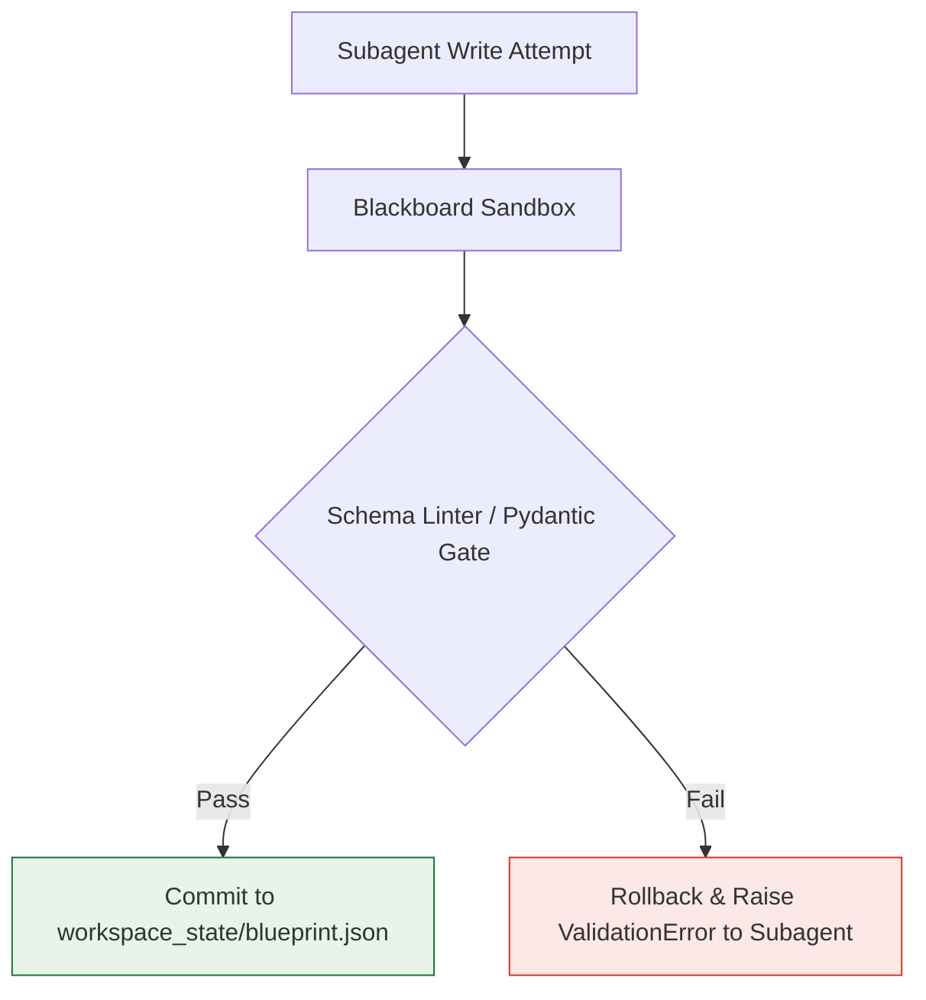

# Negative Engineering Study: Failure Modes & Mitigations in Multi-Subagent Blackboard Architectures

> [!WARNING]
> **Abstract**: While decomposing monolithic LLM agents into cooperative, workspace-backed subagents drastically increases task accuracy, it introduces novel system-level failure modes. This document details five critical vulnerabilities in the subagent-blackboard architecture, analyzing their technical triggers, expected symptoms, and engineering mitigations.

---

## 1. Failure Mode Matrix

| Failure Mode | Primary Technical Trigger | Expected System Symptom | Severity | Mitigation Strategy |
| :--- | :--- | :--- | :---: | :--- |
| **1. Path Resolving Drift** | Subagents execute in dynamic branched/sandboxed workspace locations, using hardcoded relative paths. | `FileNotFoundError` or tool execution failures during workspace operations. | **High** | **Absolute Workspace Environment Variables** |
| **2. Schema Syntactic Drift** | Lack of strict compilation gates on the file system blackboard. | Invalid JSON models written by one subagent causing parser crashes in another. | **Critical**| **Automated Pydantic/Schema Linter Gate** |
| **3. State Lock Race Conditions** | Concurrent subagent writing to the shared `workspace_state/` files. | Overwritten configurations and corrupted state trackers. | **Medium** | **Sequential Lock-File Mutex** |
| **4. Skill Ingestion Attention Deficit** | Subagent ignores the `view_file` instruction, relying instead on internal training data. | Subagent hallucinates generic standard instructions instead of following repo-specific skills. | **High** | **Pre-flight Verification Hook** |
| **5. Silent Failure Cascades** | A subagent's internal script fails (non-zero exit) but returns a generic text string instead of a structured error code.| The Orchestrator assumes success, triggering subsequent deployment phases with broken code. | **Critical**| **Strict Exit Code & Schema Contract Verification** |

---

## 2. In-Depth Analysis & Engineered Mitigations

### 2.1. Path Resolving Drift (Relative Paths)
*   **Why it fails**: Subagents are often spawned inside Git worktrees or CitC branches (e.g., when their workspace mode is set to `branch`). If the system prompts or skill files instruct a subagent to access a skill via relative paths (like `../skills/my_skill/SKILL.md`), the call will fail because the subagent's active current working directory (CWD) is branched or offset from the expected repo root.
*   **The Mitigation**: Enforce the use of the system-injected environment variable **`ANTIGRAVITY_EXECUTABLE_DATA_DIR`** or use absolute path references based on the active workspace root (`/usr/local/google/home/shacharb/skynet/`). Prompts must never contain relative paths.
    ```markdown
    # Correct Prompt Guideline
    Read the skill rules using absolute mapping:
    "${WORKSPACE_ROOT}/.agents/skills/codelab-formatting/SKILL.md"
    ```

---

### 2.2. Schema Syntactic Drift (The Garbled Blackboard)
*   **Why it fails**: When the `cloud-architect` subagent writes to `blueprint.json`, it might use standard text casing or slightly modified key names (e.g., writing `"vpcName"` instead of `"vpc_name"`). When the `security-critic` reads the blackboard, its JSON parser crashes or fails to locate the key, resulting in an unhandled exception.
*   **The Mitigation**: All blackboard state writes must pass through a structured validation script. We can run a micro-command (e.g., `python3 scripts/validate_schema.py --file blueprint.json`) immediately after a subagent claims to have completed a write operation. If validation fails, the blackboard rolls back, and the subagent is forced to correct its syntax.



---

### 2.3. State Lock Race Conditions (Concurrency Conflicts)
*   **Why it fails**: In advanced pipelines, the Orchestrator might spawn the `security-critic` to audit existing configurations while concurrently launching the `cloud-architect` to draft new resources. If both attempt to append entries to `audit_report.json` or `blueprint.json` concurrently, a standard race condition occurs, corrupting the files.
*   **The Mitigation**: Implement a simple **optimistic lock file** (mutex) pattern. Any subagent attempting to modify a blackboard file must first verify that a `.lock` file does not exist, create a `blueprint.json.lock` containing its unique conversation ID, execute the edit, and release the lock. If a lock is active, the subagent waits (e.g., backoff sleep) before retrying.

---

### 2.4. Skill Ingestion Attention Deficit (Halucination)
*   **Why it fails**: LLMs are inherently lazy when processing large system prompts. If a prompt says: *"Review formatting rules in `.agents/skills/codelab-formatting/SKILL.md`,"* the subagent may skip calling the `view_file` tool altogether, assuming it already knows how to format Markdown from pre-training. It will then produce standard Markdown that fails to satisfy your repository's strict DevSite rules.
*   **The Mitigation**: Implement a **Pre-flight Verification Hook** in the subagent's bootstrap sequence. The prompt must specify:
    > *"To demonstrate compliance, your very first tool call in this conversation MUST be a `view_file` execution targeting `${WORKSPACE_ROOT}/.agents/skills/codelab-formatting/SKILL.md`. Under no circumstances should you return a text response before executing this tool call."*

---

### 2.5. Silent Failure Cascades
*   **Why it fails**: If the `chaos-tester` subagent runs a validation command (e.g., `tester.py`) and the script fails because of a transient GCP networking issue, the subagent might return a polite text response summarizing the session without explicitly raising a failure flag. The Orchestrator reads the polite text, fails to parse it as a critical error, and proceeds to final delivery.
*   **The Mitigation**: Strictly require all subagents to return a structured JSON envelope at the end of their turn containing explicit success parameters and exit codes:
    ```json
    {
      "subagent_status": "FAILED",
      "exit_code": 1,
      "error_category": "GCP_API_TIMEOUT",
      "blackboard_pointer": "workspace_state/validation_state.json"
    }
    ```
    The Orchestrator reads this structured envelope; if `subagent_status` is not `SUCCESS`, it halts the workflow instantly and initiates automatic self-remediation loops.
