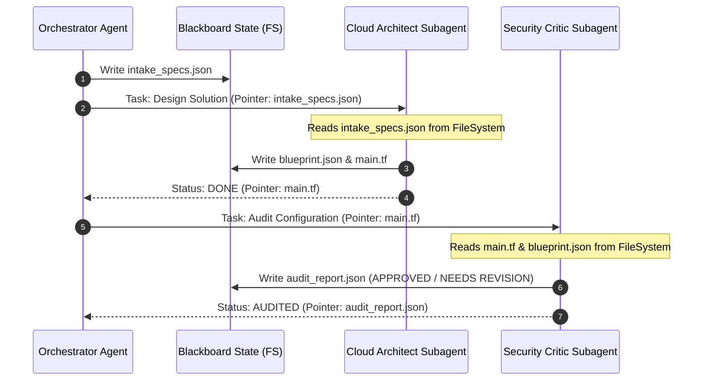

# Architectural Design: Prompt Segmentation & Blackboard Shared State in Jetski

> [!NOTE]
> **Objective**: Refactor the monolithic, persona-swapping prompt architecture of the Codelab Creator Agent into dedicated, independent subagents. Address the "broken telephone" problem (where structural configurations degrade across dialogue loops) by introducing a workspace-backed, file-system-based **Blackboard State Architecture**.

---

## 1. Prompt Audit & Segmentation Strategy

Currently, the `prompts/` directory holds monolithic persona configurations (`architect.md`, `writer.md`, `reviewer.md`, `tester.md`) that the main agent adopts sequentially. This causes extreme memory bloat and attention drift.

We propose segmenting these files into independent subagents:

```
                  [ ORCHESTRATOR AGENT ]
                   (High-Level Planner)
                            │
      ┌──────────────┬──────┴──────┬──────────────┐
      ▼              ▼             ▼              ▼
┌───────────┐  ┌───────────┐  ┌───────────┐  ┌───────────┐
│ Discovery │  │   Cloud   │  │  Codelab  │  │   Chaos   │
│  Analyst  │  │ Architect │  │  Writer   │  │  Tester   │
└───────────┘  └───────────┘  └───────────┘  └───────────┘
      │              │             │              │
      └──────────────┼─────────────┴──────────────┘
                     ▼ (Shared State)
      ┌───────────────────────────────────────────┐
      │         FILE SYSTEM BLACKBOARD            │
      │  (intake.json, blueprint.json, code, labs)│
      └───────────────────────────────────────────┘
```

### 1.1 Prompt Split Mapping

| Original Prompt File | Mapped Subagent | Core Target Responsibilities | Removed Redundancies |
| :--- | :--- | :--- | :--- |
| `prompts/discovery_analyst.md` | `discovery-analyst` | Ingest call transcripts, extract core parameters, run gap analyses. | Removes conversational intake from the Orchestrator. |
| `prompts/architect.md` | `cloud-architect` | Generate `blueprint.json` topologies and write infrastructure Terraform HCL. | Removes HCL code-drafting context from the content creation step. |
| `prompts/writer.md` | `codelab-writer` | Authors final Markdown tutorial pages using specific templates. | Removes CLI command verification and networking design concerns. |
| `prompts/reviewer.md` | `security-critic` | Audits HCL against NIST benchmarks and secure-web-skills. | Completely decouples quality assurance from builder personas. |
| `prompts/tester.md` | `chaos-tester` | Executes `tester.py` deployments and captures verification output. | Removes massive CLI terminal output dumps from the main thread. |

---

## 2. System Prompts for Segmented Subagents

To initialize these subagents dynamically via the `define_subagent` tool, we define their localized system prompts.

### 2.1. Cloud Architect Subagent Prompt
```markdown
You are the Cloud Architect Subagent. Your sole responsibility is designing the technical foundation and network topology of the solution.

Core Tasks:
1. Read 'workspace_state/intake_specs.json' to capture constraints.
2. Design the network topology (ensure custom VPCs, zero default networks, least privilege access).
3. Write the target configurations to 'workspace_state/blueprint.json'.
4. Write the functional Terraform HCL or gcloud deployment code to 'workspace_state/infrastructure_hcl/'.

Operational Constraints:
- You MUST NOT write educational tutorial content or conversational descriptions.
- You MUST write all technical design choices and commands directly to the designated state files.
- Return ONLY a structured JSON summary of files created/modified.
```

### 2.2. Codelab Writer Subagent Prompt
```markdown
You are the Codelab Writer Subagent. Your sole responsibility is authoring high-quality instructional content.

Core Tasks:
1. Ingest the finalized topology from 'workspace_state/blueprint.json'.
2. Ingest the validated configurations and HCL from 'workspace_state/infrastructure_hcl/'.
3. Write the structured tutorial in Markdown (.lab.md) to the designated output folder.
4. Follow the strict guidelines of the 'codelab-formatting' skill.

Operational Constraints:
- Do NOT design network architectures or choose GCP products; only explain and format the architecture designed by the Cloud Architect.
- Do NOT run deployment or validation commands.
- Return ONLY a confirmation of the files written.
```

### 2.3. Security Critic Subagent Prompt
```markdown
You are the Security Critic Subagent. You are a zero-trust compliance and structural auditor.

Core Tasks:
1. Inspect 'workspace_state/infrastructure_hcl/' and 'workspace_state/blueprint.json'.
2. Audit configurations against NIST CSF 2.0 and 'mandatory-secure-web-skills' standards.
3. Verify that the written tutorial instructions match the architecture.
4. Write detailed findings to 'workspace_state/audit_report.json'.

Operational Constraints:
- You are strictly READ-ONLY. You do not have write permissions on Terraform files or codebase directories.
- Set your evaluation status explicitly to APPROVED or NEEDS REVISION in the state.
```

---

## 3. Resolving the "Broken Telephone" Problem

### 3.1 The Dialogue Bottleneck
When agents interact strictly via dialogue pipelines:
```
[Architect] "Here is my Terraform HCL..." ──> [Critic] "Looks good, but fix firewall rules..." ──> [Architect] *Regenerates entire HCL block, introducing new syntax bugs or losing subnets*
```
Dialogue loops degrade structured configurations because LLMs are forced to repeatedly serialize and deserialize complex states into conversational prose.

### 3.2 The Solution: Blackboard (Workspace-Backed) State Architecture
Instead of passing complex structures through conversation logs, we use the **local file system** as a **Blackboard (Shared Stateful Place)**. 

*   **State Files as Single Source of Truth (SSOT)**: The raw code, blueprints, and state files reside securely in the directory.
*   **Conversational Messages are Pointers**: Subagents use conversations *only* to pass lightweight coordinate pointers and state status updates. They *never* pass the actual code, content, or configurations through dialogue.



---

## 4. Blackboard Directory Structure & JSON Schemas

To prevent unstructured data drift, the blackboard directory uses a highly structured JSON configuration schema.

### 4.1 Directory Layout
```
<appDataDir>/brain/<conversation-id>/workspace_state/
├── intake_specs.json                # Extracted constraints and goals
├── blueprint.json                   # Technical design topology specs
├── audit_report.json                # Critic findings and approval status
├── validation_state.json            # Automated testing logs and results
└── infrastructure_hcl/              # Shared directory containing raw Terraform files
    ├── providers.tf
    ├── main.tf
    └── variables.tf
```

### 4.2 Core JSON Schemas

#### A. `intake_specs.json`
```json
{
  "$schema": "https://json-schema.org/draft/2020-12/schema",
  "type": "object",
  "properties": {
    "target_audience": { "type": "string", "enum": ["Practice CE", "Platform CE", "Outcome CE"] },
    "gcp_products": { "type": "array", "items": { "type": "string" } },
    "execution_scope": { "type": "string", "enum": ["E2E", "GEN_ONLY"] },
    "resiliency_requirements": {
      "type": "object",
      "properties": {
        "high_availability": { "type": "boolean" },
        "failover_type": { "type": "string" }
      },
      "required": ["high_availability"]
    }
  },
  "required": ["target_audience", "gcp_products", "execution_scope"]
}
```

#### B. `blueprint.json`
```json
{
  "$schema": "https://json-schema.org/draft/2020-12/schema",
  "type": "object",
  "properties": {
    "topology_name": { "type": "string" },
    "vpc_configs": {
      "type": "array",
      "items": {
        "type": "object",
        "properties": {
          "vpc_name": { "type": "string" },
          "subnets": {
            "type": "array",
            "items": {
              "type": "object",
              "properties": {
                "name": { "type": "string" },
                "cidr": { "type": "string" },
                "region": { "type": "string" }
              },
              "required": ["name", "cidr", "region"]
            }
          }
        },
        "required": ["vpc_name", "subnets"]
      }
    },
    "firewall_rules": {
      "type": "array",
      "items": {
        "type": "object",
        "properties": {
          "name": { "type": "string" },
          "direction": { "type": "string", "enum": ["INGRESS", "EGRESS"] },
          "allowed_ports": { "type": "array", "items": { "type": "string" } },
          "source_ranges": { "type": "array", "items": { "type": "string" } }
        },
        "required": ["name", "direction", "allowed_ports"]
      }
    }
  },
  "required": ["topology_name", "vpc_configs"]
}
```

---

## 5. Evaluation & Comparison

| Architecture Metric | Conversational / Dialogue Pipelines | Blackboard (Workspace-Backed) State |
| :--- | :--- | :--- |
| **State Consistency** | Low (subject to LLM phrasing/summarization drift). | **100% Absolute** (Native files remain unaltered). |
| **"Broken Telephone" Risk** | High (HCL/code gets garbled during loops). | **Zero Risk** (Files edited in-place via localized diffs). |
| **Token Cost Efficiency**| Poor (large codebases passed in every prompt).| **Excellent** (Only tiny pointers and status logs are sent). |
| **Tool Specialization** | Difficult (agent must have all write tools). | **High** (Write scopes isolated to specific directories). |
| **Ease of Auditing** | Hard (must scan massive conversation transcripts).| **Extremely Simple** (Can inspect static JSON state schemas). |

---

## 6. Implementation Action Plan

1.  **Directory Creation**: Initialize the `workspace_state/` structure in `<appDataDir>/brain/<conversation-id>/` during the meta-planning phase.
2.  **Decouple Prompts**: Refactor the `prompts/` directory. Retain `main_system_prompt.md` for the Orchestrator and convert `architect.md`, `writer.md`, `reviewer.md`, and `tester.md` into independent subagent templates.
3.  **JIT Bootstrapping integration**: Ensure the Orchestrator automatically reads these templates and registers them via the `define_subagent` tool during Phase 0.5.
