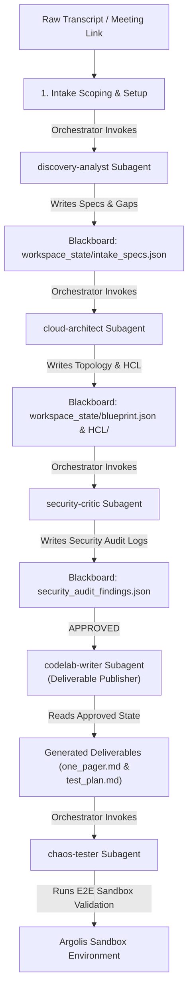

# Architectural Impact Analysis: Workflow Evolution under the Multi-Subagent Blackboard Model

> [!NOTE]
> **Objective**: Detail the exact modifications, prompt splits, and orchestration conversions required inside [create-codelab.md](file:///.agents/workflows/create-codelab.md) and [extract-requirements.md](file:///doc/extract-requirements.md) to transition their monolithic single-agent pipelines into decoupled, stateful multi-subagent networks.

---

## 1. Impact Summary on `.agents/workflows/create-codelab.md`

The [create-codelab.md](file:///.agents/workflows/create-codelab.md) workflow acts as the master orchestration directive. Currently, it instructs a single agent to sequentially swap its dynamic "persona" configurations. 

### 1.1 Mapped Conversions

Under the subagent model, we replace dynamic persona-swapping with **explicit subagent delegation blocks** interacting via the **Blackboard (`workspace_state/`)**:

```diff
- 3. **Phase 1: Research, Scope Intake & Upfront Alignment**
-    - Consult the **[architect.md](prompts/architect.md)** persona guidelines.
-    - Invoke the **`ask_question`** tool to present three interactive intake questions...
+ 3. **Phase 1: Scope Intake, Requirements Parsing & Upfront Alignment**
+    - **JIT Subagent Bootstrapping**: Trigger `scripts/compile_prompts.py` to compile prompts manifest and register subagents using the `define_subagent` tool.
+    - **Decoupled Scope Intake**: Invoke the **`discovery-analyst`** subagent. Have it present interactive intake questions and write extracted parameters strictly to `workspace_state/intake_specs.json` on the Blackboard.
```

```diff
- 4. **Phase 2: Technical Blueprint Design**
-    - **CRITICAL RULE - PREVIEW-FIRST BLUEPRINTING**: Do not author plain markdown files directly into the target repo folder initially. Instead, instruct the Architect persona to generate an **ephemeral preview blueprint** inside `<appDataDir>/brain/<conversation-id>/blueprint.md`.
+ 4. **Phase 2: Technical Blueprint Design**
+    - **Subagent Execution**: Invoke the **`cloud-architect`** subagent. It reads `workspace_state/intake_specs.json` from the Blackboard, designs the topology, and writes `workspace_state/blueprint.json` and raw Terraform code to `workspace_state/infrastructure_hcl/` in-place.
+    - **Mandatory Parallel Architecture Audit (P0 Gate)**: Spawn the **`security-critic`** subagent to audit the drafted HCL against zero-trust and `mandatory-secure-web-skills` standards. It writes its findings directly to `workspace_state/security_audit_findings.json`. If policies are violated, the Orchestrator dispatches findings back to `cloud-architect` to remediate before proceeding.
```

```diff
- 5. **Phase 3: Narrative Content Generation & Packaging**
-    - Delegate drafting tasks to the **[writer.md](prompts/writer.md)** persona guidelines.
+ 5. **Phase 3: Narrative Content Generation & Packaging**
+    - **Subagent Execution**: Invoke the **`codelab-writer`** subagent. It ingests the validated `blueprint.json` and secure HCL files directly from the Blackboard and authors the Markdown tutorial `.lab.md` inside the target lab directory.
```

```diff
- 6. **Phase 4: Hermetic Verification (Full E2E Scope Only)**
-    - Provision a pristine sandboxed test environment... execute the unified **codelab-validation** stateful tester script.
+ 6. **Phase 4: Hermetic Verification (Full E2E Scope Only)**
+    - **Subagent Execution**: Invoke the **`chaos-tester`** subagent. It statefully provisions the test sandbox project and triggers the `tester.py` validation engine, writing all execution logs directly to `workspace_state/validation_state.json`.
```

```diff
- 7. **Phase 5: Quality Review, Clean-up Choice & Final Delivery (Full E2E Scope Only)**
-    - Delegate content quality checks to the **[reviewer.md](prompts/reviewer.md)** persona guidelines.
+ 7. **Phase 5: Quality Review, Clean-up Choice & Final Delivery (Full E2E Scope Only)**
+    - **Subagent Execution**: Invoke the **`codelab-reviewer`** subagent. It audits the drafted Markdown tutorial for formatting compliant with DevSite frontmatter rules and instructional design pedagogy, writing its report directly to `workspace_state/style_audit_report.json`.
```

---

## 2. Impact Summary on `doc/extract-requirements.md`

The [extract-requirements.md](file:///doc/extract-requirements.md) documentation maps our pre-sales Solutions Engineering pipeline. Currently, this entire multi-stage pipeline is driven by a **single monolithic prompt authority** (`prompts/discovery_analyst.md`), with the single agent sequentially shifting its output styles using localized flags (`--format blueprint`, `--format gap_analysis`, etc.).

### 2.1 The Decoupled Pipeline Flow

Under the subagent blackboard model, we eliminate the monolithic formatting flag swaps. The pre-sales pipeline is driven by a **stateful collaborative subagent network**:



### 2.2 Key Modifications in `doc/extract-requirements.md`

1.  **Removal of `prompts/discovery_analyst.md` Monolithic Control**:
    *   Instead of a single prompt steering all deliverables via format flags (blueprint, gap analysis, design blueprint, one-pager, test plan), we segment these roles cleanly.
    *   `discovery-analyst` subagent owns requirement extraction and gap analysis.
    *   `cloud-architect` subagent owns design blueprinting and network topology.
    *   `codelab-writer` subagent owns deliverable packaging (formatting one-pagers and test plans based on design data).
2.  **Addition of the Pre-Sales Security Gate**:
    *   *The Gap*: In the current pipeline, a design is shown to the customer (manual review) *before* any automated verification or security scans.
    *   *The Enhancement*: We introduce `security-critic` as a mandatory gate immediately after Phase 2. The subagent automatically reviews our pre-sales Terraform and architecture designs. This guarantees that we never present a flawed or insecure design to the customer.
3.  **Standardized State Tracking**:
    *   All pre-sales deliverables leverage the exact same `.agents/state/workspace_state/` blackboard directory. This unifies engineering tools across both post-sales codelab development and pre-sales consulting engineering pipelines.
