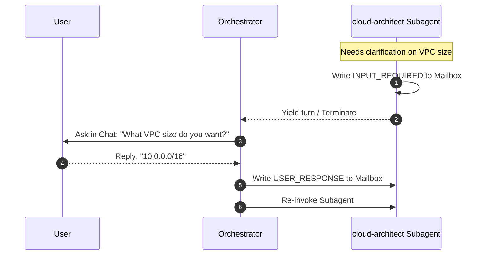

# Workflow Negative Engineering: Failure Modes in Multi-Subagent Orchestration

> [!WARNING]
> **Objective**: Evaluate the operational risks, branch synchronization blocks, and interactive limits that could cause the multi-subagent workflows ([create-codelab.md](file:///.agents/workflows/create-codelab.md) and [extract-requirements.md](file:///doc/extract-requirements.md)) to fail during live execution, and outline strict system-level mitigations.

---

## 1. Workflow Failure Mode Analysis

When transforming monolithic workflow pipelines into collaborative subagent networks, the primary failure risks shift from *model generation errors* to *system-level orchestration blocks*:

```
[Monolithic Model Errors]  ───> [Subagent System Blocks]
(e.g., HCL syntax typos)        (e.g., Branch synch gaps, schema drift, hung UI modals)
```

### 1.1 Core Failure Modes

#### Failure Mode A: Workspace Synchronization Gaps (Branch Mode Mismatches)
*   **The Trigger**: When a subagent is spawned using the `branch` workspace mode, the Jetski platform creates a local git worktree clone or isolated folder structure. If the subagent writes its updates (like `blueprint.json`) and terminates, but those file changes are **not programmatically synced back** to the parent Orchestrator's active directory, the Orchestrator will read empty or stale files.
*   **The Consequence**: Stalled pipelines, missing code blocks, or immediate workflow failures during content compilation.
*   **The Mitigation**: 
    - Under standard E2E runs, the Orchestrator **MUST enforce the `inherit` workspace mode** for all collaborative subagents, ensuring they read and write directly to the identical file directories in-place.
    - `branch` mode must be reserved strictly for sandboxed testing (such as in the `chaos-tester` subagent's validation loop).

#### Failure Mode B: Decoupled Schema Syntactic Drift
*   **The Trigger**: The `discovery-analyst` extracts user requirements and writes `workspace_state/intake_specs.json`. If it saves a key as `"vpc"` instead of `"vpc_configs"`, or serializes a subnet CIDR list incorrectly, the `cloud-architect` subagent will fail to parse the file.
*   **The Consequence**: Unhandled exceptions or severe technical hallucinations in subsequent design steps.
*   **The Mitigation**: The Blackboard JSON schemas (defined in the architecture proposal) must be strictly validated. The Orchestrator must execute a validation micro-linter (Pydantic/JSON Schema check) immediately after any subagent claims to have completed a Blackboard write. If validation fails, the Orchestrator rejects the step and prompts the subagent to correct the format.

#### Failure Mode C: The "Silent Interactivity Hang" (Subagent Tool Mismatches)
*   **The Trigger**: Codelab workflows rely heavily on interactive human gates (`ask_question` modals). If a subagent (like `cloud-architect`) invokes `ask_question` internally, the runtime environment will often fail to forward the subagent's tool requests to the user's active chat screen.
*   **The Consequence**: The subagent hangs indefinitely, waiting for a user confirmation that can never be rendered in the UI.
*   **The Mitigation**: **Strict System Rule**: Subagents must never call the `ask_question` tool directly. All human-in-the-loop interactions must be managed exclusively by the parent Orchestrator. If a subagent requires user clarification, it must write an `"action_type": "INPUT_REQUIRED"` message to its mailbox and yield control. The Orchestrator intercepts the message and prompts the user in the chat.



#### Failure Mode D: Authentication & ADC Context Mismatches
*   **The Trigger**: In both workflows, the final stages provision active Argolis sandboxes. If a subagent (like `chaos-tester`) executes a `gcloud` command under the corporate employee identity (`<ldap>@google.com`) instead of the sandbox administrator account (`admin@<user-domain>.altostrat.com`), the API call will fail with a `403 PERMISSION_DENIED`.
*   **The Consequence**: Complete validation crash during sandbox testing.
*   **The Mitigation**: Enforce the global `gcloud-auth-verification` check *prior* to spawning the `chaos-tester` subagent. The Orchestrator locks the credentials standard globally, and the subagent simply inherits the active secure context.

---

## 2. Conclusion: Is the Migration Safe?

**Yes, provided the Orchestrator enforces the mitigations outline above.**

By:
1.  Using `inherit` workspace mode to keep the blackboard local and in-place.
2.  Gating all Blackboard JSON writes with strict schema linters.
3.  Centralizing all `ask_question` human interactivity inside the parent Orchestrator thread.
4.  Locking the gcloud ADC credential context globally at pre-flight.

We completely mitigate system-level failures, ensuring a highly stable, deterministic, and resilient multi-subagent pipeline.
